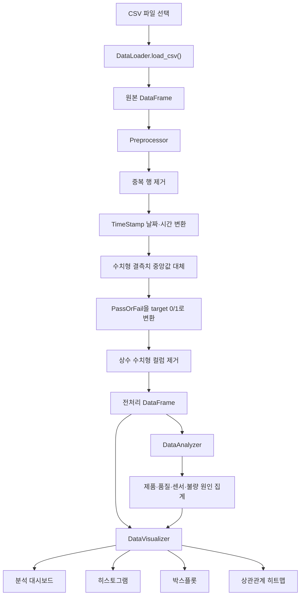
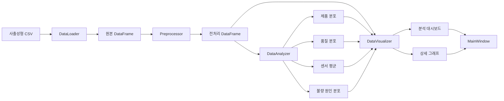

# Analyze 패키지

## 1. 개요

`Analyze` 패키지는 사출성형 공정 CSV 데이터를 불러와 전처리하고, CN7·RG3 제품의 생산 현황과 품질 상태를 분석·시각화하는 기능을 담당합니다.

이 패키지는 단독 프로그램이 아니라 `UI` 패키지와 연결되어 사용됩니다. 사용자가 UI에서 CSV 파일을 선택하고 분석을 실행하면 다음 작업을 순서대로 처리합니다.

1. CSV 파일 불러오기
2. 중복·결측치·날짜 데이터 전처리
3. 양품과 불량을 머신러닝용 숫자로 변환
4. CN7·RG3 제품 비율 분석
5. 양품·불량 비율과 불량 원인 분석
6. 센서 데이터의 평균과 분포 분석
7. 분석 결과를 대시보드와 그래프로 표시

> `Analyze`는 데이터 로드·전처리·통계분석·시각화를 담당합니다.  
> 실제 머신러닝 모델 학습과 교차검증은 `ML` 패키지에서 담당합니다.

---

## 2. 주요 기능

| 구분 | 담당 클래스 | 주요 기능 |
|---|---|---|
| 데이터 로드 | `DataLoader` | CSV 파일을 Pandas DataFrame으로 불러오기 |
| 데이터 전처리 | `Preprocessor` | 중복 제거, 날짜 변환, 결측치 처리, 타깃 인코딩 |
| 통계분석 | `DataAnalyzer` | 제품·품질·센서 평균·불량 원인 분석 |
| 데이터 시각화 | `DataVisualizer` | 대시보드, 히스토그램, 박스플롯, 상관관계 히트맵 생성 |

---

## 3. 실행 전 준비사항

프로젝트 루트 폴더에서 필요한 라이브러리를 설치합니다.

```bash
python -m pip install pandas numpy matplotlib ttkbootstrap scikit-learn
```

크롤링 기능까지 실행하려면 다음 라이브러리도 필요합니다.

```bash
python -m pip install beautifulsoup4 selenium
```

분석에 사용하는 기본 CSV 파일은 다음 폴더에 있습니다.

```text
04. Dataset_Molding/
└── dataset/
    ├── labeled_data.csv
    ├── unlabeled_data.csv
    ├── moldset_labeled_cn7.csv
    ├── moldset_labeled_rg3.csv
    ├── moldset_unlabeled_cn7.csv
    └── moldset_unlabeled_rg3.csv
```

일반 데이터 분석에는 `labeled_data.csv`를 사용할 수 있습니다. 머신러닝 교차검증은 `ML` 패키지에서 제품별 `moldset_*` 데이터를 별도로 사용합니다.

---

## 4. 실행 방법

`Analyze` 패키지는 별도의 단독 실행 파일을 제공하지 않습니다. 프로젝트 루트 폴더에서 UI를 실행하여 사용합니다.

### 기본 분석 UI 실행

```bash
python main.py
```

다음 기능을 사용할 수 있습니다.

- CSV 데이터 불러오기
- 데이터 미리보기
- 데이터 전처리
- 분석 대시보드
- 센서 데이터 시각화
- CN7·RG3 모델 교차검증

### 크롤링 포함 UI 실행

```bash
python main_crawler.py
```

기본 분석 UI 기능에 다음 기능이 추가됩니다.

- CSV의 `Reason` 컬럼에서 불량 원인 추출
- 불량 원인 관련 웹 문서 검색
- 검색 문서의 제목·URL·본문 확인

### UI 사용 순서

```text
프로그램 실행
→ CSV 파일 선택
→ 데이터 불러오기
→ 데이터 전처리
→ 분석 실행
→ 대시보드 확인
→ 그래프 종류와 센서 선택
→ 그래프 생성
```

---

## 5. Python 코드에서 직접 사용하기

UI를 사용하지 않고 Python 코드에서 각 분석 모듈을 직접 호출할 수도 있습니다.

```python
from Analyze.data_analyzer import DataAnalyzer
from Analyze.data_loader import DataLoader
from Analyze.data_visualizer import DataVisualizer
from Analyze.preprocessor import Preprocessor


# 1. CSV 파일 불러오기
loader = DataLoader()
df = loader.load_csv(
    "04. Dataset_Molding/dataset/labeled_data.csv"
)

# 2. 데이터 전처리
processor = Preprocessor(df)
processor.remove_duplicates()
processor.convert_datetime("TimeStamp")
processor.fill_missing()
processor.encode_target()
processor.remove_constant_numeric_columns(
    exclude={"target", "PART_FACT_SERIAL"}
)
clean_df = processor.get_data()

# 3. 데이터 분석
analyzer = DataAnalyzer(clean_df)

product_distribution = analyzer.get_product_distribution()
quality_distribution = analyzer.get_quality_distribution()
numeric_summary = analyzer.get_numeric_mean_summary()
fault_distribution = analyzer.get_fault_reason_distribution()

# 4. 종합 대시보드 생성
visualizer = DataVisualizer(clean_df)
figure = visualizer.plot_dashboard(
    product_distribution=product_distribution,
    quality_distribution=quality_distribution,
    numeric_summary=numeric_summary,
    fault_distribution=fault_distribution,
)

figure.show()
```

---

## 6. 실행 화면과 페이지별 기능

### 6.1 데이터 미리보기 페이지


CSV 파일을 불러온 후 데이터의 컬럼과 상위 100행을 확인하는 화면입니다.

할 수 있는 작업:

- 분석할 CSV 파일 선택
- CSV 데이터 불러오기
- 전체 행과 열 개수 확인
- 센서 및 품질 컬럼 확인
- 전처리 전·후 데이터 비교
- CN7·RG3 데이터만 필터링하여 불러오기

화면 상단의 버튼은 다음 순서로 사용할 수 있습니다.

```text
1. 데이터 로드 → 2. 전처리 → 3. 분석 → 4. 모델 학습
```

주요 확인 컬럼:

- `PART_NAME`: 제품명
- `PassOrFail`: 양품·불량 판정
- `Reason`: 불량 원인
- `TimeStamp`: 생산 시각
- `Injection_Time`: 사출시간
- `Filling_Time`: 충전시간
- `Max_Injection_Speed`: 최대 사출속도
- `Max_Injection_Pressure`: 최대 사출압력
- `Barrel_Temperature_*`: 배럴 온도
- `Mold_Temperature_*`: 금형 온도

---

### 6.2 분석 대시보드 페이지


전처리된 데이터를 집계하여 제품 구성, 품질 상태, 센서 평균과 불량 원인 현황을 한 화면에 표시합니다.

할 수 있는 작업:

- 전체 분석 데이터 건수 확인
- CN7 생산 건수와 비율 확인
- RG3 생산 건수와 비율 확인
- 전체 불량 건수와 불량률 확인
- 주요 공정 센서의 평균값 확인
- 불량 원인별 발생 건수와 비율 확인

대시보드는 다음 항목으로 구성됩니다.

| 화면 구성 | 설명 |
|---|---|
| 전체 데이터 KPI | 분석 대상의 전체 행과 컬럼 수 |
| CN7·RG3 비율 KPI | 제품별 데이터 건수와 비율 |
| 전체 불량률 KPI | 불량 건수와 전체 데이터 대비 비율 |
| 특성별 평균 그래프 | 시간·속도·압력·위치 관련 센서 평균 |
| 제품 비율 그래프 | CN7과 RG3 데이터 구성 |
| 품질 비율 그래프 | 양품과 불량의 비율 |
| 고장 원인 그래프 | 가스·미성형 등 원인별 불량 현황 |

---

### 6.3 데이터 시각화 페이지

시각화 페이지에서는 그래프 종류와 센서 컬럼을 선택하여 공정 데이터의 분포와 변수 간 관계를 확인할 수 있습니다.

선택 가능한 그래프:

- 히스토그램
- 품질별 박스플롯
- 상관관계 히트맵

#### 상관관계 히트맵


수치형 컬럼 사이의 상관계수를 색상으로 표시합니다.

확인할 수 있는 내용:

- 함께 증가하거나 감소하는 센서 변수
- 서로 유사한 공정 특성을 가진 변수
- 중복 정보를 가질 가능성이 있는 센서
- 품질 판정값 `target`과 각 센서의 선형적 관계

색상의 의미:

| 상관계수 | 의미 |
|---:|---|
| 1에 가까움 | 두 변수가 함께 증가하는 강한 양의 상관관계 |
| 0에 가까움 | 두 변수 사이의 선형적 관계가 거의 없음 |
| -1에 가까움 | 한 변수가 증가할 때 다른 변수가 감소하는 강한 음의 상관관계 |

> 상관관계는 변수 사이의 선형적 관계를 나타내지만, 직접적인 원인과 결과를 증명하지는 않습니다.

#### 히스토그램


선택한 수치형 센서값이 어느 구간에 주로 분포하는지 확인합니다. 위 화면은 `Max_Injection_Speed`의 분포를 나타냅니다.

확인할 수 있는 내용:

- 센서값이 집중된 구간
- 전체 데이터의 값 범위
- 분포의 치우침
- 서로 분리된 데이터 집단
- 극단적으로 크거나 작은 값

#### 품질별 박스플롯

품질별 박스플롯을 선택하면 센서 데이터를 `PassOrFail` 기준으로 나누어 양품과 불량의 분포를 비교할 수 있습니다.

확인할 수 있는 내용:

- 양품과 불량의 중앙값 차이
- 데이터가 퍼진 정도
- 사분위 범위
- 이상치
- 특정 센서와 불량 판정 사이의 차이

#### 상관관계 히트맵

전체 수치형 컬럼 사이의 상관계수를 색상으로 표시합니다.

확인할 수 있는 내용:

- 함께 증가하거나 감소하는 센서
- 서로 유사한 공정 특성을 가진 변수
- 중복 정보가 있을 가능성이 있는 변수
- 품질 판정과 관련될 가능성이 있는 변수

> 상관관계는 두 변수의 선형적인 관계를 나타낼 뿐이며, 원인과 결과를 직접 증명하지는 않습니다.

---

## 7. 데이터 처리 흐름



---

## 8. 아키텍처



### 모듈 간 역할

| 계층 | 모듈 | 역할 |
|---|---|---|
| 입력 | `DataLoader` | CSV 파일을 DataFrame으로 변환 |
| 전처리 | `Preprocessor` | 분석 가능한 형태로 데이터 정리 |
| 분석 | `DataAnalyzer` | 화면에 표시할 통계값 계산 |
| 표현 | `DataVisualizer` | 분석 결과를 Matplotlib Figure로 생성 |
| 화면 | `UI.MainWindow` | 분석 결과와 그래프를 사용자에게 표시 |

---

## 9. 파일과 클래스 설명

### 9.1 `data_loader.py`

#### `DataLoader`

CSV 파일을 Pandas DataFrame으로 불러옵니다.

##### `load_csv(file_path)`

```python
load_csv(file_path)
```

주요 동작:

- `pandas.read_csv()`로 CSV 파일 읽기
- 읽은 DataFrame을 `self.df`에 저장
- 불러온 DataFrame 반환

입력:

- `file_path`: 불러올 CSV 파일 경로

반환:

- `pandas.DataFrame`

---

### 9.2 `preprocessor.py`

#### `Preprocessor`

원본 DataFrame의 복사본을 생성한 뒤 분석에 필요한 전처리를 수행합니다. 원본 DataFrame 자체는 직접 변경하지 않습니다.

##### `check_missing()`

컬럼별 결측치 개수를 반환합니다.

```python
missing_counts = processor.check_missing()
```

##### `fill_missing()`

수치형 컬럼의 결측치를 각 컬럼의 중앙값으로 대체합니다.

중앙값을 사용하는 이유:

- 평균보다 이상치의 영향을 적게 받음
- 센서 데이터에 극단값이 있을 때 비교적 안정적임

> 문자열·날짜 컬럼의 결측치는 이 메서드에서 처리하지 않습니다.

##### `convert_datetime(column)`

지정한 컬럼을 Pandas 날짜·시간 자료형으로 변환합니다.

```python
processor.convert_datetime("TimeStamp")
```

변환할 수 없는 값은 `NaT`로 처리됩니다.

##### `remove_columns(columns)`

분석이나 학습에 필요하지 않은 컬럼을 제거합니다.

```python
processor.remove_columns(["_id", "EQUIP_NAME"])
```

존재하지 않는 컬럼이 포함되어 있어도 오류를 발생시키지 않습니다.

##### `remove_duplicates()`

모든 컬럼값이 동일한 완전 중복 행을 제거합니다.

##### `remove_constant_numeric_columns(exclude=None)`

모든 행에서 값이 동일한 수치형 컬럼을 제거합니다.

이러한 컬럼은 데이터 구분에 필요한 정보가 없으므로 분석과 모델 학습에서 제외할 수 있습니다.

```python
removed_columns = processor.remove_constant_numeric_columns(
    exclude={"target", "PART_FACT_SERIAL"}
)
```

반환값은 제거된 컬럼 이름 목록입니다.

##### `encode_target(source="PassOrFail", target="target")`

품질 판정을 머신러닝에서 사용할 수 있는 숫자로 변환합니다.

| `PassOrFail` | 의미 | `target` |
|---|---|---:|
| `Y` | 양품 | 0 |
| `N` | 불량 | 1 |

원본 `PassOrFail` 컬럼은 유지되고 새로운 `target` 컬럼이 추가됩니다.

##### `get_data()`

현재까지 전처리된 DataFrame의 복사본을 반환합니다.

---

### 9.3 `data_analyzer.py`

#### `DataAnalyzer`

전처리된 DataFrame을 이용하여 제품·품질·센서·불량 원인 통계를 계산합니다.

##### `get_product_distribution()`

`PART_NAME`의 접두어를 기준으로 CN7·RG3 제품의 건수와 비율을 계산합니다.

반환 컬럼:

| 컬럼 | 설명 |
|---|---|
| `count` | 제품별 데이터 건수 |
| `ratio` | 0~1 범위의 비율 |
| `percentage` | 백분율 |

##### `get_quality_distribution()`

`PassOrFail`을 기준으로 양품과 불량의 건수·비율을 계산합니다.

기본 판정:

- `Y`: 양품
- `N`: 불량

##### `get_numeric_mean_summary()`

수치형 센서 컬럼별 요약 정보를 계산합니다.

반환 컬럼:

| 컬럼 | 설명 |
|---|---|
| `category` | 시간·속도·압력·위치·온도·기타 분류 |
| `mean` | 센서 평균값 |
| `valid_count` | 결측치가 아닌 데이터 수 |
| `missing_count` | 결측치 수 |

`PART_FACT_SERIAL`과 `target`은 기본적으로 평균 분석에서 제외됩니다.

##### `get_fault_reason_distribution()`

불량으로 판정된 행만 대상으로 `Reason`별 건수와 비율을 계산합니다.

처리 조건:

```text
PassOrFail == "N"
```

빈 문자열과 결측 원인은 분석에서 제외됩니다.

#### 내부 보조 함수

| 함수 | 역할 |
|---|---|
| `_get_sensor_category()` | 컬럼명으로 센서 특성 분류 |
| `_make_distribution()` | 건수·비율·백분율 DataFrame 생성 |
| `_normalize_product_codes()` | 제품 코드 공백·대소문자·중복 검사 |
| `_require_columns()` | 필수 컬럼 존재 여부 검사 |

---

### 9.4 `data_visualizer.py`

#### `DataVisualizer`

DataFrame과 분석 결과를 Matplotlib `Figure` 객체로 변환합니다.

##### `plot_histogram(column, bins=30)`

수치형 컬럼의 히스토그램을 생성합니다.

##### `plot_boxplot(column, group_column=None)`

전체 또는 그룹별 박스플롯을 생성합니다.

UI에서는 다음과 같이 품질별 비교에 사용합니다.

```python
visualizer.plot_boxplot(
    column="Max_Injection_Speed",
    group_column="PassOrFail",
)
```

##### `plot_correlation_heatmap()`

전체 수치형 컬럼의 상관계수 행렬을 계산하고 히트맵으로 표시합니다.

상관계수 범위:

| 값 | 의미 |
|---:|---|
| 1에 가까움 | 강한 양의 상관관계 |
| 0에 가까움 | 선형 상관관계가 거의 없음 |
| -1에 가까움 | 강한 음의 상관관계 |

##### `plot_dashboard(...)`

다음 분석 결과를 하나의 종합 대시보드로 구성합니다.

- CN7·RG3 제품 비율
- 양품·불량 비율
- 전체 불량률
- 시간·속도·압력·위치 센서 평균
- 불량 원인별 발생 건수

반환된 `Figure`는 UI의 Tkinter Canvas에 표시됩니다.

#### 내부 보조 함수

| 함수 | 역할 |
|---|---|
| `_plot_dashboard_pie()` | 제품 비율 원형 그래프 생성 |
| `_plot_quality_donut()` | 양품·불량 도넛 그래프 생성 |
| `_plot_numeric_means()` | 센서 특성별 평균 막대그래프 생성 |
| `_plot_fault_reasons()` | 불량 원인별 막대그래프 생성 |
| `_require_column()` | 컬럼 존재 여부 검사 |
| `_require_numeric_column()` | 수치형 컬럼 여부 검사 |

---

## 10. 폴더 구조

```text
Analyze/
├── __init__.py
│   └── Analyze 패키지 초기화 파일
│
├── data_loader.py
│   └── CSV 파일을 DataFrame으로 불러오는 모듈
│
├── preprocessor.py
│   └── 중복·결측치·날짜·타깃 데이터를 전처리하는 모듈
│
├── data_analyzer.py
│   └── 제품·품질·센서·불량 원인 통계를 계산하는 모듈
│
├── data_visualizer.py
│   └── 분석 결과를 Matplotlib 그래프로 생성하는 모듈
│
└── README.md
    └── Analyze 패키지 사용 및 구조 설명
```

---

## 11. 입력 데이터 요구사항

일반 분석 기능을 모두 사용하려면 CSV에 다음 컬럼이 필요합니다.

| 컬럼 | 사용 기능 | 필수 여부 |
|---|---|---|
| `PART_NAME` | CN7·RG3 제품 분류 | 제품 분석 시 필수 |
| `PassOrFail` | 양품·불량 분석과 타깃 변환 | 품질 분석 시 필수 |
| `Reason` | 불량 원인 분석 | 원인 분석 시 필수 |
| `TimeStamp` | 날짜·시간 변환 | 전처리 시 필요 |
| 수치형 센서 컬럼 | 평균·히스토그램·박스플롯·상관관계 | 시각화 시 필요 |

필수 컬럼이 없는 데이터로 해당 기능을 실행하면 `KeyError` 또는 `ValueError`가 발생할 수 있습니다.

---

## 12. 주의사항과 한계

### 결측치 처리

`fill_missing()`은 수치형 컬럼만 처리합니다. 문자열과 날짜 컬럼의 결측치는 별도로 확인해야 합니다.

### 날짜 변환

`convert_datetime()`에서 변환할 수 없는 값은 `NaT`가 됩니다. 이후 `fill_missing()`으로는 날짜 결측치가 처리되지 않습니다.

### 품질값 형식

`encode_target()`은 `PassOrFail` 값이 정확히 `Y` 또는 `N`일 때만 숫자로 변환합니다. 다른 값은 `target`에서 결측치가 될 수 있습니다.

### 상관관계 해석

상관관계가 높다고 해서 한 변수가 다른 변수의 직접적인 원인이라는 의미는 아닙니다. 공정 조건과 품질 결과를 함께 검토해야 합니다.

### 제품 코드

기본 제품 분석 대상은 CN7과 RG3입니다. 다른 제품을 분석하려면 `get_product_distribution()`의 `product_codes` 인자를 변경해야 합니다.

### 원본 데이터 보호

`Preprocessor`, `DataAnalyzer`, `DataVisualizer`는 전달받은 DataFrame의 복사본을 사용합니다. 따라서 일반적인 사용 과정에서는 원본 DataFrame을 직접 변경하지 않습니다.

---

## 13. 다른 패키지와의 관계

```text
Analyze
├── UI에서 CSV 분석과 그래프 생성에 사용
├── Crawling UI에서 Reason 목록을 만들 때 사용
└── ML 모델 결과와 함께 종합 분석 화면을 구성
```

관련 문서:

- [프로젝트 전체 README](../README.md)
- [ML 패키지](../ML/README.md)
- [UI 패키지](../UI/README.md)
- [Crawling 패키지](../Crawling/README.md)