# Analyze 모듈 실행 흐름 정리

## 1. 목적과 파일 구성

`Analyze` 패키지는 제조 CSV를 DataFrame으로 불러오고, 분석 가능한 형태로
전처리하고, 대시보드 통계를 계산한 뒤 Matplotlib Figure로 변환한다.

| 파일 | 클래스 | 입력 | 출력 |
|---|---|---|---|
| `data_loader.py` | `DataLoader` | CSV 경로 | 원본 DataFrame |
| `preprocessor.py` | `Preprocessor` | 원본 DataFrame | 정제 DataFrame |
| `data_analyzer.py` | `DataAnalyzer` | 분석 DataFrame | 집계 DataFrame |
| `data_visualizer.py` | `DataVisualizer` | 데이터·집계값 | Matplotlib `Figure` |

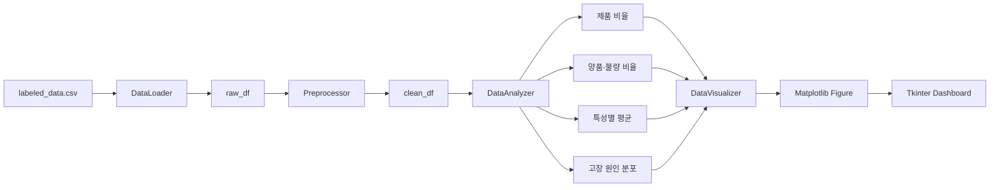

## 2. 기능별 시간 순서

| 단계 | 클래스 | 대표 함수 | 핵심 결과 |
|---:|---|---|---|
| 1 | `DataLoader` | `load_csv()` | CSV → DataFrame |
| 2 | `Preprocessor` | 전처리 함수 연속 호출 | 중복·결측·타입·상수 컬럼 정리 |
| 3 | `DataAnalyzer` | `get_*()` | 차트용 집계표 생성 |
| 4 | `DataVisualizer` | `plot_*()` | UI에 삽입 가능한 Figure 생성 |

---

# DataLoader

## 3. CSV 로드 순서

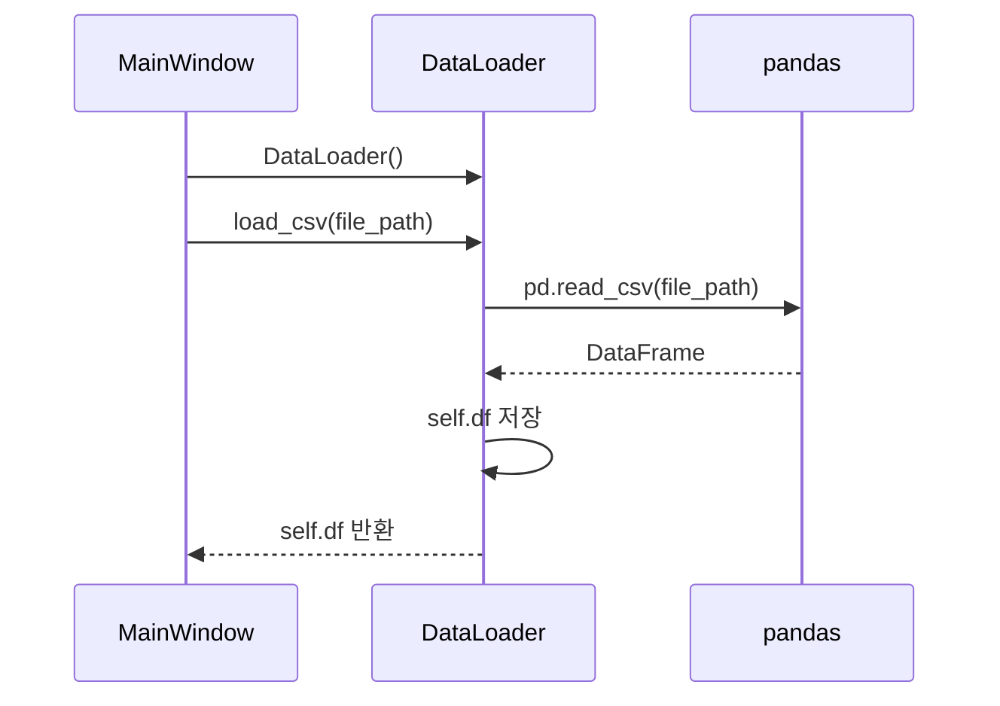

| 함수 | 실행 시점 | 처리 | 상태 변화 |
|---|---|---|---|
| `__init__()` | 객체 생성 | 데이터 저장 공간 초기화 | `self.df = None` |
| `load_csv(file_path)` | CSV 로드 | Pandas로 CSV 파싱 | `self.df = DataFrame` |

---

# Preprocessor

## 4. 권장 전처리 순서

`Preprocessor`는 전달받은 DataFrame을 복사하여 원본 객체를 직접 변경하지 않는다.
각 함수는 `self.df`에 전처리 결과를 누적한다.

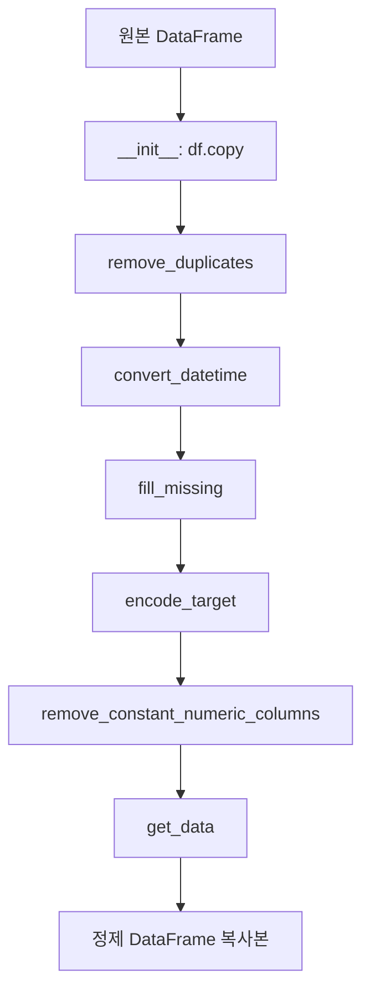

| 권장 순서 | 함수 | 처리 내용 | 반환값 |
|---:|---|---|---|
| 0 | `__init__(df)` | 원본 DataFrame 복사 | 없음 |
| 진단 | `check_missing()` | 컬럼별 결측치 개수 계산 | Series |
| 1 | `remove_duplicates()` | 완전 중복 행 제거 | DataFrame |
| 2 | `convert_datetime(column)` | 변환 실패값을 `NaT`로 처리 | DataFrame |
| 3 | `fill_missing()` | 수치형 컬럼별 중앙값 대체 | DataFrame |
| 선택 | `remove_columns(columns)` | 지정 컬럼 제거, 없는 컬럼 무시 | DataFrame |
| 4 | `encode_target()` | `Y→0`, `N→1` target 생성 | DataFrame |
| 5 | `remove_constant_numeric_columns()` | 고유값 1개 이하 수치 컬럼 제거 | 제거 컬럼 목록 |
| 6 | `get_data()` | 현재 결과의 복사본 반환 | DataFrame |

### 전처리 전후 비교

| 검사 항목 | 처리 전 | 처리 후 |
|---|---|---|
| 중복 행 | 존재 가능 | 완전 중복 제거 |
| `TimeStamp` | 문자열일 수 있음 | datetime, 실패값은 `NaT` |
| 수치형 결측값 | `NaN` 가능 | 각 컬럼 중앙값 |
| 품질 라벨 | `PassOrFail = Y/N` | `target = 0/1` 추가 |
| 상수 수치 컬럼 | 분석에 포함 가능 | 식별자·target 제외 후 제거 |

### 상수 컬럼 판단

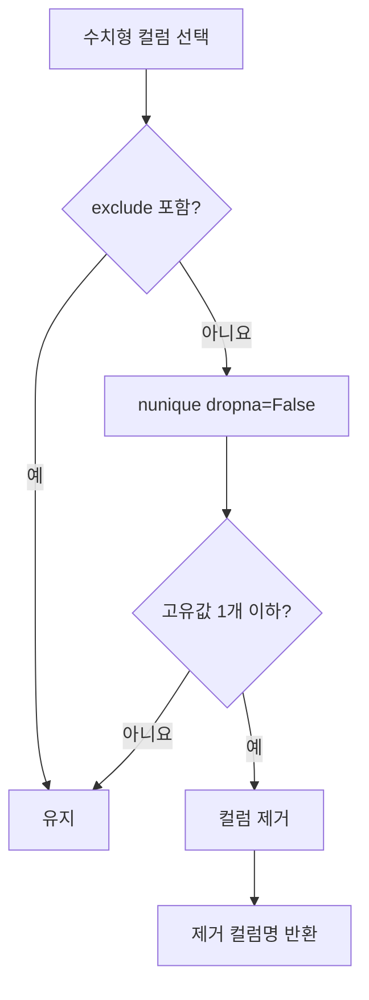

---

# DataAnalyzer

## 5. 분석 책임과 출력

`DataAnalyzer`는 그래프를 그리지 않고 의미가 명확한 집계 DataFrame을 만든다.
색상과 화면 배치는 `DataVisualizer`가 담당한다.

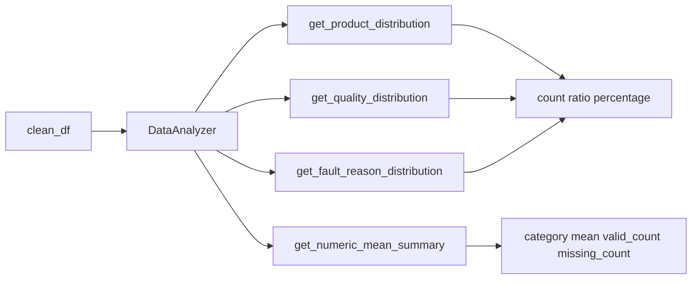

| 함수 | 분석 대상 | 결과 인덱스 | 결과 컬럼 |
|---|---|---|---|
| `get_product_distribution()` | `PART_NAME`의 CN7·RG3 | `product` | `count`, `ratio`, `percentage` |
| `get_quality_distribution()` | `PassOrFail`의 Y·N | `quality` | `count`, `ratio`, `percentage` |
| `get_numeric_mean_summary()` | 수치형 컬럼 | `indicator` | `category`, `mean`, `valid_count`, `missing_count` |
| `get_fault_reason_distribution()` | 불량 행의 `Reason` | `fault_reason` | `count`, `ratio`, `percentage` |

## 6. 제품 비율 분석 순서

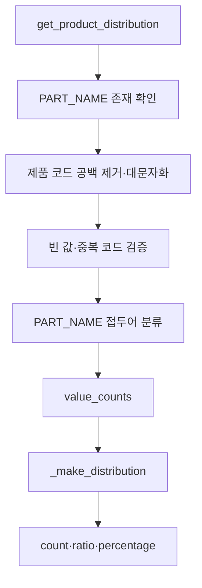

기본 대상은 `CN7`, `RG3`이다. 특정 제품 데이터가 없어도 해당 제품을 0건으로
유지하기 때문에 UI에서 항상 같은 두 범주를 표시할 수 있다.

## 7. 양품·불량 분석 순서

| 원본값 | 분석 라벨 | 처리 |
|---|---|---|
| `Y` | 양품 | 집계 포함 |
| `N` | 불량 | 집계 포함 |
| 그 외 | - | 집계 제외 |

문자열 앞뒤 공백과 대소문자 차이를 정리한 후 건수, 비율, 퍼센트를 계산한다.

## 8. 특성별 주요 수치 평균

### 결과 표 구조

| indicator | category | mean | valid_count | missing_count |
|---|---|---:|---:|---:|
| `Injection_Time` | Time | 평균 | 유효값 수 | 결측값 수 |
| `Injection_Speed` | 속도 | 평균 | 유효값 수 | 결측값 수 |
| `Max_Injection_Pressure` | 압력 | 평균 | 유효값 수 | 결측값 수 |
| `Screw_Position` | 위치 | 평균 | 유효값 수 | 결측값 수 |

### 컬럼 이름 분류 규칙

| category | 검사 키워드 |
|---|---|
| `Time` | `time` |
| `속도` | `speed`, `rpm` |
| `압력` | `pressure` |
| `위치` | `position` |
| `온도` | `temperature`, `temp` |
| `기타` | 위 규칙에 해당하지 않음 |

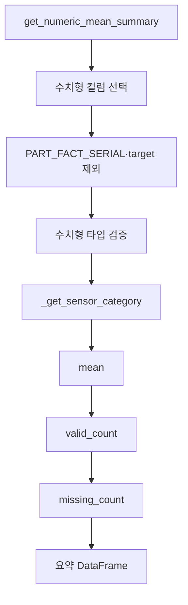

> 분석 결과에는 `온도`와 `기타`도 포함될 수 있다. 현재 대시보드 막대그래프는
> `SENSOR_CATEGORY_ORDER`에 정의된 `Time`, `속도`, `압력`, `위치`만 표시한다.

## 9. 고장 원인 분석 순서

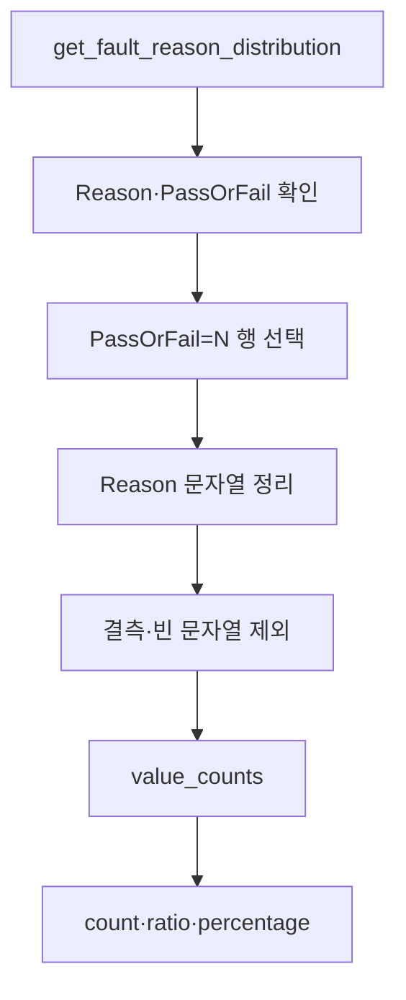

양품 행은 고장 원인 집계에서 제외하며 불량 행의 원인만 분모로 사용한다.

## 10. 내부 분석 함수

| 함수 | 호출 위치 | 역할 |
|---|---|---|
| `_get_sensor_category()` | 수치 평균 분석 | 컬럼 이름을 공정 특성으로 분류 |
| `_make_distribution()` | 제품·품질·고장원인 분석 | 건수에서 비율·퍼센트 생성 |
| `_normalize_product_codes()` | 제품 분석 | 제품 코드 정규화와 중복 검증 |
| `_require_columns()` | 공개 분석 함수 | 필수 컬럼 누락 시 `KeyError` |

---

# DataVisualizer

## 11. 시각화 책임

`DataVisualizer`는 원본 DataFrame이나 `DataAnalyzer` 집계표를 받아 Matplotlib
`Figure`를 반환한다. `plt.show()`를 직접 호출하지 않아 Tkinter Canvas에 삽입할 수 있다.

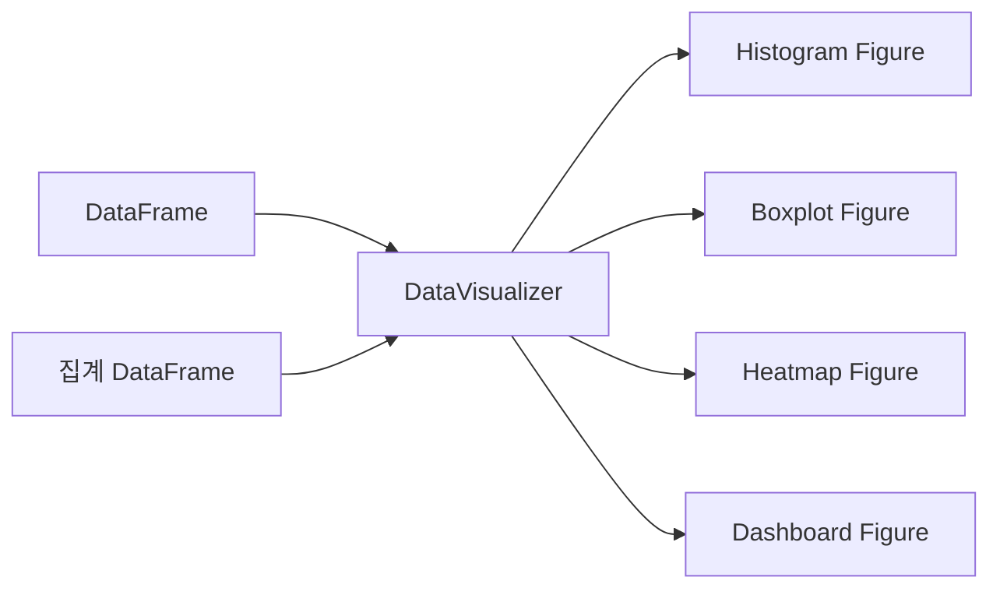

## 12. 상세 그래프 함수

| 함수 | 선행 검증 | 그래프 | 용도 |
|---|---|---|---|
| `plot_histogram(column, bins)` | 수치형 컬럼 | 히스토그램 | 단일 컬럼 분포 |
| `plot_boxplot(column)` | 수치형 컬럼 | 박스플롯 | 중앙값·사분위·이상치 |
| `plot_boxplot(column, group_column)` | 수치형·그룹 컬럼 | 그룹 박스플롯 | 양품·불량 비교 |
| `plot_correlation_heatmap()` | 수치 컬럼 존재 | 히트맵 | 컬럼 간 선형 상관관계 |

## 13. 대시보드 생성 순서

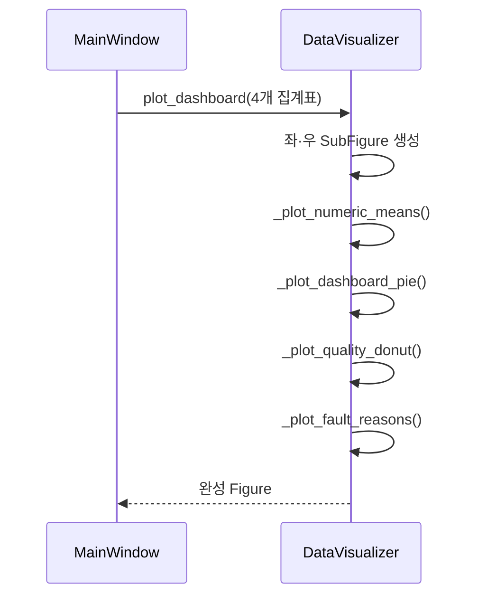

```text
┌───────────────────────────────┬──────────────────────────┐
│ 특성별 주요 수치 평균          │ CN7·RG3    양품·불량      │
│ ┌──────────┬──────────┐       │ 파이차트    도넛차트       │
│ │ Time     │ 속도      │       ├──────────────────────────┤
│ ├──────────┼──────────┤       │ 고장 원인별 불량 현황      │
│ │ 압력      │ 위치      │       │ 가로 막대그래프            │
│ └──────────┴──────────┘       │                          │
└───────────────────────────────┴──────────────────────────┘
```

### 영역별 색상

| 영역 | 색상 코드 | 표현 색상 |
|---|---|---|
| Time | `#F59E0B` | 주황 |
| 속도 | `#8B5CF6` | 보라 |
| 압력 | `#3B82F6` | 파랑 |
| 위치 | `#22C55E` | 초록 |
| CN7 | `#2563EB` | 파랑 |
| RG3 | `#14B8A6` | 청록 |
| 양품 | `#22C55E` | 초록 |
| 불량 | `#EF4444` | 빨강 |
| 고장 원인 | `#F59E0B` | 주황 |

| 내부 함수 | 입력 | 표시 내용 |
|---|---|---|
| `_plot_numeric_means()` | `numeric_summary` | 범주별 가로 막대그래프 |
| `_plot_dashboard_pie()` | 제품 분포 | CN7·RG3 건수·비율 |
| `_plot_quality_donut()` | 품질 분포 | 양품·불량과 중앙 불량률 |
| `_plot_fault_reasons()` | 원인 분포 | 원인별 불량 건수·퍼센트 |

데이터가 비어 있으면 각 내부 함수는 예외 대신 `표시할 데이터가 없습니다.`를 표시한다.

## 14. 시각화 검증 순서

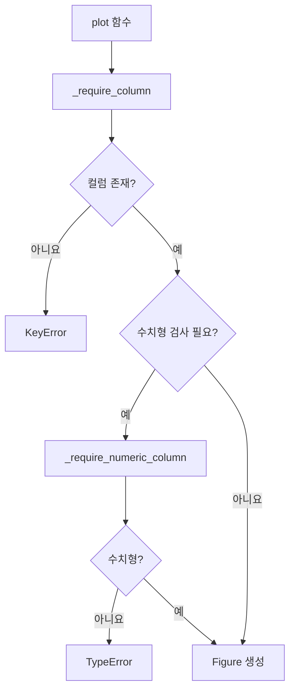

| 함수 | 실패 조건 | 오류 |
|---|---|---|
| `_require_column()` | 컬럼 없음 | `KeyError` |
| `_require_numeric_column()` | 수치형 아님 | `TypeError` |
| `plot_correlation_heatmap()` | 수치형 컬럼 없음 | `ValueError` |

## 15. 클래스 관계와 함수 트리

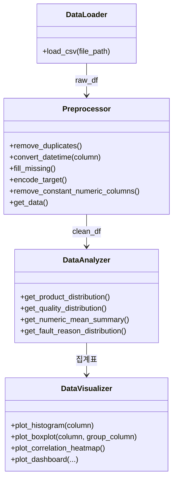

```text
DataLoader
└── __init__, load_csv

Preprocessor
└── __init__, check_missing, fill_missing, convert_datetime,
    remove_columns, remove_duplicates, remove_constant_numeric_columns,
    encode_target, get_data

DataAnalyzer
└── __init__, get_product_distribution, get_quality_distribution,
    get_numeric_mean_summary, get_fault_reason_distribution,
    _get_sensor_category, _make_distribution,
    _normalize_product_codes, _require_columns

DataVisualizer
└── __init__, plot_histogram, plot_boxplot, plot_correlation_heatmap,
    plot_dashboard, _plot_dashboard_pie, _plot_quality_donut,
    _plot_numeric_means, _plot_fault_reasons,
    _require_column, _require_numeric_column
```