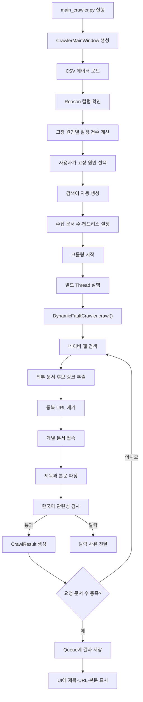
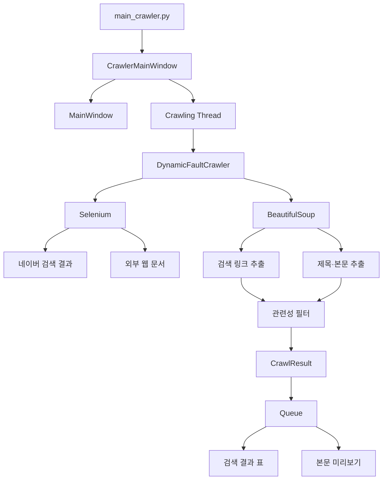

# Crawling 패키지

## 1. 개요

`Crawling` 패키지는 사출성형 불량 원인과 관련된 한국어 웹 문서를 검색·수집하는 기능을 담당합니다.

사용자가 UI에서 CSV 데이터의 고장 원인을 선택하면 다음 순서로 동작합니다.

1. 선택한 고장 원인으로 검색어 생성
2. Selenium으로 네이버 웹 검색 실행
3. 검색 결과에서 외부 웹 문서 링크 추출
4. 개별 웹 문서 접속
5. BeautifulSoup으로 제목과 본문 추출
6. 한국어·사출성형·불량 원인·제조 관련성 검사
7. 조건을 통과한 문서의 제목·URL·본문 반환
8. UI에서 검색 결과와 본문 표시

현재 지원하는 고장 원인은 다음 세 가지입니다.

- 가스
- 미성형
- 초기허용불량

---

## 2. 주요 기능

| 기능 | 설명 |
|---|---|
| 네이버 웹 검색 | 입력한 검색어로 네이버 웹 검색 수행 |
| 동적 페이지 로딩 | Selenium Chrome WebDriver로 페이지 렌더링 |
| 검색 링크 추출 | 검색 결과에서 외부 HTTP·HTTPS 문서 추출 |
| 중복 제거 | 같은 URL이 여러 번 나타날 경우 한 번만 처리 |
| 본문 파싱 | 제목과 article·main·body 영역의 텍스트 추출 |
| 한국어 검사 | 제목·본문의 한글 수와 한글 비율 검사 |
| 사출성형 관련성 검사 | 제목에 사출성형 관련 용어가 있는지 확인 |
| 불량 원인 검사 | 선택한 원인 또는 관련 동의어가 있는지 확인 |
| 제조 문서 검사 | 본문에 제조 관련 용어가 충분히 있는지 확인 |
| 결과 반환 | 문서 제목·URL·본문을 `CrawlResult`로 반환 |
| 진행 상황 알림 | UI에 검색·검사·수집 진행 상황 전달 |

---

## 3. 실행 전 준비사항

### 3.1 Python 라이브러리 설치

프로젝트 루트 폴더에서 다음 명령을 실행합니다.

```bash
python -m pip install ttkbootstrap pandas matplotlib scikit-learn
python -m pip install beautifulsoup4 selenium
```

### 3.2 Chrome 브라우저

크롤링은 Selenium Chrome WebDriver를 사용하므로 Chrome 브라우저가 필요합니다.

최근 Selenium은 Selenium Manager를 통해 환경에 맞는 ChromeDriver를 자동으로 준비할 수 있습니다. Chrome과 Selenium의 버전이 맞지 않으면 브라우저 실행에 실패할 수 있습니다.

### 3.3 인터넷 연결

다음 작업을 위해 인터넷 연결이 필요합니다.

- 네이버 검색 결과 접속
- 검색 결과의 외부 문서 접속
- 본문 HTML 수집

---

## 4. 실행 방법

`Crawling` 패키지는 UI를 통해 실행하는 것을 기본으로 합니다.

프로젝트 루트 폴더에서 다음 명령을 실행합니다.

```bash
python main_crawler.py
```

> `python main.py`로 실행하면 고장 원인 조사 페이지가 표시되지 않습니다.

### UI 사용 순서

```text
1. CSV 파일 선택
→ 2. 데이터 로드
→ 3. 고장 원인 조사 탭 선택
→ 4. 고장 원인 선택
→ 5. 검색어 확인 또는 수정
→ 6. 수집할 문서 수 설정
→ 7. 크롤링 실행
→ 8. 검색 결과 확인
→ 9. 문서 본문 확인
```

---

## 5. Python 코드에서 직접 사용하기

UI를 사용하지 않고 `DynamicFaultCrawler`를 직접 호출할 수도 있습니다.

```python
from Crawling.dynamic_fault_crawler import DynamicFaultCrawler


crawler = DynamicFaultCrawler(
    headless=True,
    timeout=12,
    max_content_chars=6000,
)

results = crawler.crawl(
    query="사출성형 가스 불량 원인 해결 방법",
    max_pages=5,
    required_reason="가스",
    progress=print,
)

for result in results:
    print("제목:", result.title)
    print("URL:", result.url)
    print("본문:", result.content[:300])
    print("-" * 50)
```

> 현재 `max_pages`는 이름과 달리 검색 페이지 수가 아니라 최종적으로 수집할 문서 수를 의미합니다. 입력 가능한 값은 1~10입니다.

---

## 6. 실행 화면


고장 원인 조사 화면은 다음 영역으로 구성됩니다.

### 6.1 데이터의 고장 원인

CSV 파일의 `Reason` 컬럼에서 불량 원인을 추출하고 발생 건수와 함께 표시합니다.

예시:

```text
가스 (35건)
초기허용불량 (20건)
미성형 (16건)
```

사용자가 원인을 선택하면 검색어가 자동으로 생성됩니다.

```text
사출성형 {선택한 원인} 불량 원인 해결 방법
```

### 6.2 동적 웹 크롤링 설정

| 설정 | 설명 |
|---|---|
| 선택 원인 | 현재 선택한 고장 원인 |
| 검색어 | 네이버에서 검색할 문자열 |
| 문서 수 | 최종적으로 수집할 문서 수, 1~10 |
| 브라우저 숨김 | Chrome을 화면에 표시하지 않고 실행 |
| 선택 원인 크롤링 | 별도 Thread에서 웹 문서 수집 시작 |

### 6.3 검색 결과

조건을 통과한 문서의 제목과 출처 URL을 표로 표시합니다.

할 수 있는 작업:

- 수집 문서 제목 확인
- 출처 URL 확인
- 결과 행 선택
- 결과 행을 더블클릭하여 브라우저에서 열기

### 6.4 수집 본문 미리보기

검색 결과에서 선택한 문서의 다음 내용을 표시합니다.

- 문서 제목
- 출처 URL
- 수집된 본문
- 선택 문서 웹에서 열기 버튼

### 6.5 상태 표시줄

화면 하단에서 현재 진행 상황을 확인할 수 있습니다.

예시:

```text
네이버 검색 결과 1페이지 확인 중
한국어·관련성 확인 중
수집 제외: 제목에 사출성형 없음
문서 수집 완료 (3/10)
웹 자료 수집 완료: 10건
```

---

## 7. 전체 처리 흐름



---

## 8. 문서 수집 흐름

```mermaid
flowchart LR
    Query["검색어"] --> Naver["네이버 웹 검색"]
    Naver --> Links["외부 후보 링크"]
    Links --> Unique["중복·내부 링크 제거"]
    Unique --> Selenium["Selenium 페이지 접속"]
    Selenium --> Parser["BeautifulSoup 본문 추출"]
    Parser --> Korean["한국어 검사"]
    Korean --> Title["제목의 사출성형 용어 검사"]
    Title --> Reason["불량 원인 관련어 검사"]
    Reason --> Manufacturing["제조 관련 본문 검사"]
    Manufacturing --> Result["CrawlResult"]
```



---

## 9. 아키텍처



### 구성 요소별 역할

| 구성 요소 | 역할 |
|---|---|
| `CrawlerMainWindow` | 사용자의 검색 조건 입력과 결과 표시 |
| `Thread` | UI가 멈추지 않도록 크롤링을 백그라운드에서 실행 |
| `Queue` | 크롤링 Thread와 UI 메인 스레드 사이의 데이터 전달 |
| `DynamicFaultCrawler` | 검색·수집·필터링 전체 과정 담당 |
| Selenium | 동적 검색 결과와 외부 문서 렌더링 |
| BeautifulSoup | 링크·제목·본문 파싱 |
| `CrawlResult` | 최종 수집 문서 데이터 보관 |

---

## 10. 관련성 필터

수집한 문서는 다음 네 가지 조건을 모두 통과해야 합니다.

| 검사 | 통과 조건 |
|---|---|
| 한국어 문서 | 제목과 본문이 설정된 한글 수·비율 조건 충족 |
| 사출성형 제목 | 제목에 사출성형 관련 용어 포함 |
| 불량 원인 | 제목 또는 본문에 선택 원인이나 동의어 포함 |
| 제조 본문 | 서로 다른 제조 관련 용어가 2종 이상 포함 |

---

### 10.1 한국어 문서 검사

`is_korean_document()`는 다음 기준을 사용합니다.

| 기준 | 최소 조건 |
|---|---:|
| 제목의 한글 문자 수 | 1자 이상 |
| 본문의 한글 문자 수 | 20자 이상 |
| 본문 전체 영문·한글 대비 한글 비율 | 25% 이상 |

계산 대상 문자는 다음과 같습니다.

```text
한글: 가-힣
영문: A-Z, a-z
```

숫자·공백·특수문자는 한글 비율의 분모에서 제외됩니다.

---

### 10.2 제목의 사출성형 관련 용어

제목에는 다음 중 하나가 포함되어야 합니다.

```text
사출성형
사출 성형
injection molding
injection moulding
```

본문에 관련 내용이 있더라도 제목에 위 용어가 없으면 수집 대상에서 제외됩니다.

---

### 10.3 불량 원인 관련 용어

#### 가스

```text
가스
기포
은줄
gas
bubble
silver streak
```

#### 미성형

```text
미성형
충전 부족
short shot
short-shot
incomplete filling
```

#### 초기허용불량

```text
초기허용불량
초기 불량
초기품 불량
startup defect
start-up defect
startup reject
```

선택한 원인의 관련 용어가 제목 또는 본문에 하나 이상 포함되어야 합니다.

---

### 10.4 제조 관련 본문

본문에는 서로 다른 제조 관련 용어가 2종 이상 포함되어야 합니다.

주요 검사 용어:

```text
사출, 성형, 금형, 수지, 제조, 공정, 설비, 품질,
불량, 플라스틱, injection, molding, moulding,
mold, mould, resin, manufacturing, process,
defect, plastic
```

> 현재 코드는 같은 단어가 두 번 반복되었는지를 검사하는 것이 아니라, 서로 다른 관련 용어가 몇 종류 포함되었는지를 검사합니다.

---

## 11. 클래스와 함수 설명

# `CrawlResult`

파일: [dynamic_fault_crawler.py](dynamic_fault_crawler.py)

웹에서 최종 수집한 문서 한 건을 저장하는 불변 데이터 클래스입니다.

```python
@dataclass(frozen=True)
class CrawlResult:
    title: str
    url: str
    content: str
```

| 필드 | 자료형 | 설명 |
|---|---|---|
| `title` | `str` | 문서 제목 |
| `url` | `str` | 최종 문서 URL |
| `content` | `str` | 정제된 문서 본문 |

`frozen=True`가 설정되어 생성 후 필드값을 변경할 수 없습니다.

---

# `DynamicFaultCrawler`

파일: [dynamic_fault_crawler.py](dynamic_fault_crawler.py)

Selenium과 BeautifulSoup을 결합하여 네이버 검색 결과를 순회하고 관련 한국어 제조 문서를 수집합니다.

### `__init__(headless=True, timeout=12, max_content_chars=6000)`

크롤러의 브라우저 실행 옵션을 설정합니다.

| 인자 | 기본값 | 설명 |
|---|---:|---|
| `headless` | `True` | 브라우저 화면을 숨기고 실행할지 설정 |
| `timeout` | `12` | 페이지 로딩 제한 시간 |
| `max_content_chars` | `6000` | 결과에 보관할 본문의 최대 글자 수 |

### `crawl(query, max_pages=5, progress=None, required_reason=None)`

입력값을 검사한 뒤 네이버 검색 결과와 외부 웹 문서를 순회합니다.

주요 동작:

1. 검색어 공백 정리
2. 수집 문서 수 검사
3. 고장 원인 결정
4. Selenium Chrome 실행
5. 네이버 검색 결과 순회
6. 후보 링크 추출과 중복 제거
7. 개별 웹 문서 접속
8. 제목과 본문 파싱
9. 관련성 검사
10. `CrawlResult` 생성
11. 요청한 문서 수를 충족하면 반환

인자:

| 인자 | 설명 |
|---|---|
| `query` | 네이버 검색에 사용할 문자열 |
| `max_pages` | 최종적으로 수집할 문서 수, 1~10 |
| `progress` | 진행 메시지를 받을 콜백 함수 |
| `required_reason` | 반드시 포함해야 하는 고장 원인 |

반환:

```python
list[CrawlResult]
```

크롤러는 네이버 검색 결과를 최대 20페이지까지 확인합니다. 요청한 문서 수를 충족하지 못하면 부분 결과를 반환하지 않고 `RuntimeError`를 발생시킵니다.

### `build_search_url(query, start=1)`

검색어와 검색 시작 위치를 네이버 웹 검색 URL로 변환합니다.

```python
url = DynamicFaultCrawler.build_search_url(
    "사출성형 가스 불량",
    start=1,
)
```

검색어는 `quote_plus()`로 URL 인코딩됩니다.

`start` 값이 1보다 작으면 `ValueError`가 발생합니다.

### `normalize_text(value)`

텍스트의 줄바꿈·탭·연속 공백을 하나의 공백으로 바꾸고 문자열 양쪽 공백을 제거합니다.

예시:

```text
"사출성형   가스\n불량"
→ "사출성형 가스 불량"
```

### `infer_reason(query)`

`required_reason`이 전달되지 않았을 때 검색어에서 고장 원인을 자동으로 찾습니다.

인식 가능한 원인:

- 가스
- 미성형
- 초기허용불량

검색어에서 원인을 찾지 못하면 빈 문자열을 반환합니다.

### `evaluate_relevance(title, content, reason)`

제목과 본문이 네 가지 수집 조건을 충족하는지 검사합니다.

반환값:

```python
tuple[bool, list[str]]
```

예시:

```python
(False, ["제목에 사출성형 없음", "가스 내용 없음"])
```

검사 실패 시 가능한 사유:

- 한국어 문서 아님
- 제목에 사출성형 없음
- 선택 원인 내용 없음
- 제조업 본문 아님

### `is_korean_document(title, content)`

제목과 본문의 한글 문자 수 및 비율로 한국어 문서 여부를 판단합니다.

### `extract_search_links(html)`

네이버 검색 결과 영역의 `<a>` 태그에서 외부 문서 URL과 제목을 추출합니다.

다음 링크는 제외합니다.

- HTTP·HTTPS가 아닌 링크
- 호스트가 없는 링크
- 제목이 없는 링크
- 차단 목록에 포함된 네이버 내부 도메인

차단되는 주요 도메인:

```text
search.naver.com
m.search.naver.com
help.naver.com
keep.naver.com
```

### `parse_document(html, fallback_title="")`

HTML에서 제목과 본문을 추출합니다.

먼저 다음 노이즈 태그를 제거합니다.

```text
script, style, noscript, template, svg, nav, footer, aside
```

제목 추출 우선순위:

```text
<title> → fallback_title
```

본문 추출 우선순위:

```text
<article> → <main> → <body>
```

### `_unique_links(links)`

후보 링크에서 잘못된 URL과 중복 URL을 제거합니다.

검사 항목:

- HTTP 또는 HTTPS 여부
- 호스트 존재 여부
- URL 중복 여부

### `_notify(progress, message)`

진행 상황 콜백이 등록되어 있을 때 메시지를 전달합니다.

콜백에서 오류가 발생하더라도 전체 크롤링이 중단되지 않도록 예외를 무시합니다.

### `_import_selenium()`

Selenium 관련 패키지를 동적으로 불러옵니다.

불러오는 구성 요소:

- `webdriver`
- `By`
- `expected_conditions`
- `WebDriverWait`

Selenium이 설치되어 있지 않으면 설치 안내가 포함된 `RuntimeError`를 발생시킵니다.

---

## 12. 검색 범위와 수집 규칙

| 설정 | 값 |
|---|---:|
| 검색 결과 페이지당 시작 위치 증가량 | 3 |
| 최대 검색 결과 확인 페이지 | 20 |
| 사용자가 요청할 수 있는 문서 수 | 1~10 |
| 기본 요청 문서 수 | 5 |
| 기본 페이지 로딩 제한 시간 | 12초 |
| 기본 본문 최대 저장 길이 | 6,000자 |
| 빈 검색 결과 연속 허용 | 1페이지 |
| 빈 검색 결과가 2페이지 연속 | 검색 중단 |

같은 URL은 한 번만 검사합니다.

문서 수집 중 개별 사이트에서 오류가 발생하면 해당 문서를 건너뛰고 다음 후보를 검사합니다.

---

## 13. 예외 처리

### 검색어가 없는 경우

```text
검색어를 입력하세요.
```

### 문서 수가 범위를 벗어난 경우

```text
수집 문서 수는 1~10 사이여야 합니다.
```

### 고장 원인을 확인할 수 없는 경우

```text
선택한 고장 원인을 확인할 수 없습니다.
검색어에 가스, 미성형 또는 초기허용불량을 포함하세요.
```

### 요청 문서 수를 충족하지 못한 경우

최대 검색 범위까지 확인했지만 관련 문서가 부족하면 `RuntimeError`가 발생합니다.

```text
요청한 문서 10건 중 6건만 조건을 통과했습니다.
```

### Selenium이 설치되지 않은 경우

```text
동적 크롤링에 Selenium이 필요합니다.
```

### 개별 문서 접속 실패

개별 사이트 오류는 전체 크롤링을 즉시 중단하지 않고 해당 문서만 건너뜁니다.

가능한 원인:

- 페이지 로딩 시간 초과
- 접속 차단
- 인증이 필요한 사이트
- HTML 본문 없음
- WebDriver 오류
- 사이트의 JavaScript 오류

---

## 14. 폴더 구조

```text
Crawling/
├── __init__.py
│   └── CrawlResult와 DynamicFaultCrawler 공개
│
├── dynamic_fault_crawler.py
│   └── 네이버 검색·본문 수집·관련성 필터 구현
│
├── dynamic_fault_crawler.md
│   └── 크롤러 구현 상세 문서
│
└── README.md
    └── Crawling 패키지 실행 및 구조 설명
```

크롤링 UI와 실행 파일은 다음 위치에 있습니다.

```text
python-mini-project/
├── main_crawler.py
│   └── CrawlerMainWindow 실행
│
├── Crawling/
│   └── 실제 크롤링 로직
│
└── UI/
    └── crawler_window.py
        └── 크롤링 설정과 결과 화면
```

---

## 15. 주의사항과 한계

### 검색 결과 HTML 변경

네이버 검색 결과의 HTML 구조가 변경되면 다음 선택자를 수정해야 할 수 있습니다.

```python
RESULT_CONTAINER_SELECTOR = "#main_pack"
RESULT_SELECTOR = "#main_pack a[href]"
```

### 엄격한 관련성 필터

현재 필터는 제목에 사출성형 관련 용어가 반드시 있어야 합니다. 본문이 관련 문서더라도 제목 조건을 충족하지 못하면 제외될 수 있습니다.

### 부분 결과를 반환하지 않음

요청한 수량을 모두 충족하지 못하면 수집된 일부 문서가 있더라도 최종적으로 `RuntimeError`가 발생합니다.

### 사이트별 접근 제한

다음 사이트는 정상적으로 수집되지 않을 수 있습니다.

- 로그인이 필요한 사이트
- 자동화 접속을 차단하는 사이트
- CAPTCHA를 요구하는 사이트
- 본문을 iframe으로 제공하는 사이트
- JavaScript로 본문을 지연 생성하는 사이트

### 검색 서비스 의존성

현재 크롤러는 네이버 웹 검색 구조에 의존합니다. 검색 정책이나 결과 구조가 변경되면 수집 성능이 달라질 수 있습니다.

### 수집 자료의 활용

검색 결과의 저작권과 이용 조건은 각 원문 사이트에 있습니다. 수집 본문은 프로젝트 내부의 원인 조사와 미리보기 용도로 사용하고, 외부 배포 시 원문 사이트의 이용 조건을 확인해야 합니다.

### 개인정보 노출

README에 실행 화면을 첨부할 때 CSV 입력창에 표시된 사용자명과 로컬 파일 경로를 가리는 것을 권장합니다.

---

## 16. 다른 패키지와의 관계

| 패키지 | Crawling과의 관계 |
|---|---|
| `UI` | 검색 조건 입력, Thread 실행, 진행 상황과 결과 표시 |
| `Analyze` | CSV를 불러오고 `Reason` 분석에 필요한 데이터 제공 |
| `ML` | 직접적인 실행 의존성은 없으며 불량 예측 결과 해석을 보조 |

관련 문서:

- [프로젝트 전체 README](../README.md)
- [Analyze 패키지](../Analyze/README.md)
- [ML 패키지](../ML/README.md)
- [UI 패키지](../UI/README.md)