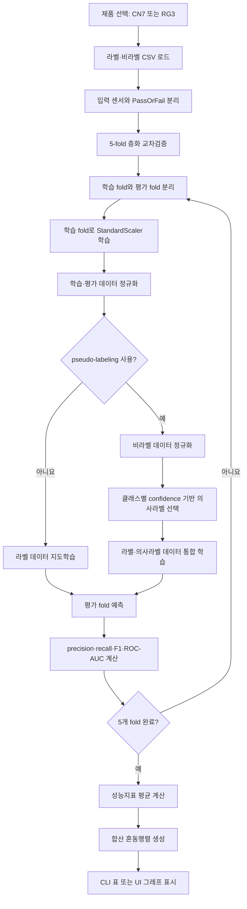
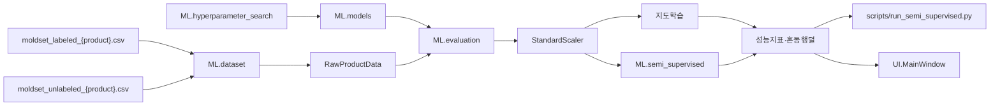

# 사출성형 불량 예측 모델

## 1. ML 패키지 개요

`ML` 패키지는 CN7·RG3 사출성형 공정의 센서 데이터를 이용하여 양품과 불량을 분류하고 모델 성능을 평가합니다.

주요 작업은 다음과 같습니다.

1. 제품별 라벨·비라벨 데이터 로드
2. 입력 센서와 품질 타깃 분리
3. GaussianNB·RandomForest·SVM 모델 생성
4. 5-fold 층화 교차검증
5. precision·recall·F1·ROC-AUC 평가
6. 모델별 혼동행렬 생성
7. pseudo-labeling 선택 실행
8. GridSearchCV 하이퍼파라미터 탐색
9. CLI와 UI에 평가 결과 제공

현재 데이터에서는 pseudo-labeling보다 라벨 데이터만 사용하는 지도학습이 더 안정적이므로 지도학습을 기본값으로 사용합니다.

---

## 2. 주요 기능

| 기능 | 담당 파일 | 설명 |
|---|---|---|
| 제품별 데이터 로드 | `dataset.py` | CN7·RG3 라벨·비라벨 CSV 로드 |
| 모델 생성 | `models.py` | GaussianNB·RandomForest·SVM 생성 |
| 모델 평가 | `evaluation.py` | 5-fold 층화 교차검증과 성능 집계 |
| 의사라벨 학습 | `semi_supervised.py` | 클래스별 confidence 기반 pseudo-labeling |
| 파라미터 탐색 | `hyperparameter_search.py` | GridSearchCV로 RF·SVM 설정 탐색 |
| CLI 실행 | `run_semi_supervised.py` | 제품별 전체 학습·평가 실행 |
| UI 출력 | `UI/main_window.py` | 모델 비교 그래프와 혼동행렬 표시 |

---

## 3. 한눈에 보기

- **목표**: 사출성형 공정 센서값으로 불량품을 미리 예측
- **평가 대상**: CN7·RG3
- **비교 모델**: GaussianNB·RandomForest·SVM
- **평가 방식**: 5-fold 층화 교차검증
- **기본 학습 방식**: 라벨 데이터만 사용하는 지도학습
- **선택 학습 방식**: 클래스별 pseudo-labeling
- **결과**
  - CN7은 어느 정도 예측 신호가 있지만 불량 탐지 성능은 제한적
  - RG3는 현재 센서값만으로 사실상 안정적인 예측이 어려움

성능이 제한적인 원인은 두 가지입니다.

1. CN7·RG3 모두 불량 사례가 매우 적습니다.
   - CN7: 라벨 데이터 1,211건 중 불량 17건
   - RG3: 라벨 데이터 1,182건 중 불량 25건
2. RG3는 현재 센서값과 불량 여부 사이의 통계적 연관성이 거의 없습니다.

따라서 현재 프로젝트는 모델 알고리즘만 정교하게 변경하는 것으로 해결하기 어렵고, 불량 표본과 추가 공정 변수를 확보하는 것이 중요합니다.

---

## 4. 실행 전 준비사항

### 4.1 라이브러리 설치

프로젝트 루트 폴더에서 다음 명령을 실행합니다.

```bash
python -m pip install pandas numpy matplotlib scikit-learn ttkbootstrap
```

### 4.2 데이터 파일

머신러닝에 사용하는 데이터는 다음 폴더에 있습니다.

```text
04. Dataset_Molding/
└── dataset/
    ├── moldset_labeled_cn7.csv
    ├── moldset_unlabeled_cn7.csv
    ├── moldset_labeled_rg3.csv
    └── moldset_unlabeled_rg3.csv
```

일반 분석 UI에서 불러오는 `labeled_data.csv`와 머신러닝 교차검증용 데이터는 구분됩니다.

`ML.dataset`은 제품별로 2차 가공된 `moldset_*` 파일을 직접 불러옵니다.

---

## 5. 입력 데이터

### 5.1 파일별 역할

| 파일 | 타깃 포함 | 용도 |
|---|---|---|
| `moldset_labeled_cn7.csv` | 있음 | CN7 지도학습과 교차검증 |
| `moldset_unlabeled_cn7.csv` | 없음 | CN7 pseudo-labeling |
| `moldset_labeled_rg3.csv` | 있음 | RG3 지도학습과 교차검증 |
| `moldset_unlabeled_rg3.csv` | 없음 | RG3 pseudo-labeling |

### 5.2 타깃 데이터

예측 대상 컬럼은 `PassOrFail`입니다.

| 값 | 의미 |
|---:|---|
| 0 | 양품 |
| 1 | 불량 |

### 5.3 입력 센서

제품별 학습 데이터에는 다음과 같은 수치형 공정 변수가 포함됩니다.

- 사출시간
- 충전시간
- 가소화시간
- 사이클시간
- 형폐시간
- 쿠션 위치
- 가소화 위치
- 형개 위치
- 최대 사출속도
- 최대·평균 스크루 RPM
- 최대 사출압력
- 최대 보압 전환압력
- 최대·평균 배압
- 배럴 온도
- 호퍼 온도
- 금형 온도

`dataset.py`는 CSV에서 이름이 `Unnamed`로 시작하는 불필요한 인덱스 컬럼을 제거합니다.

라벨 데이터와 비라벨 데이터는 동일한 입력 센서 컬럼을 사용해야 합니다.

---

## 6. 실행 방법

명령어는 프로젝트 루트 폴더에서 실행합니다.

### 6.1 기본 실행

```bash
python scripts/run_semi_supervised.py
```

기본 설정:

- CN7과 RG3 모두 평가
- GaussianNB·RandomForest·SVM 비교
- pseudo-labeling 사용 안 함
- 기본 하이퍼파라미터 사용
- 5-fold 층화 교차검증
- 비라벨 데이터 최대 5,000건 로드

pseudo-labeling이 꺼져 있으면 비라벨 데이터는 모델 학습에 사용되지 않습니다.

### 6.2 CN7만 실행

```bash
python scripts/run_semi_supervised.py --product cn7
```

### 6.3 RG3만 실행

```bash
python scripts/run_semi_supervised.py --product rg3
```

### 6.4 하이퍼파라미터 탐색

```bash
python scripts/run_semi_supervised.py --tune
```

RandomForest와 SVM의 하이퍼파라미터를 GridSearchCV로 탐색한 후 최종 교차검증을 실행합니다.

### 6.5 pseudo-labeling 사용

```bash
python scripts/run_semi_supervised.py --pseudo-label
```

라벨 없는 데이터에 모델이 예측한 값을 임시 라벨로 부여하여 학습 데이터에 추가합니다.

현재 구현은 가이드북 원본 방식의 양품 쏠림 문제를 줄이기 위해 예측 클래스별로 confidence가 높은 데이터를 선택합니다.

> 현재 데이터에서는 pseudo-labeling이 지도학습보다 성능을 낮추는 경우가 많으므로 기본값은 OFF입니다.

### 6.6 비라벨 데이터 수 제한

```bash
python scripts/run_semi_supervised.py --pseudo-label --max-unlabeled 3000
```

비라벨 데이터 최대 3,000건을 사용합니다.

전체 비라벨 데이터를 사용하려면 `0`을 지정합니다.

```bash
python scripts/run_semi_supervised.py --pseudo-label --max-unlabeled 0
```

전체 데이터를 사용하면 SVM과 반복 pseudo-labeling 학습 시간이 매우 길어질 수 있습니다.

### 6.7 CLI 옵션

| 옵션 | 기본값 | 설명 |
|---|---:|---|
| `--product cn7` | 전체 | CN7만 평가 |
| `--product rg3` | 전체 | RG3만 평가 |
| `--tune` | OFF | GridSearchCV 실행 |
| `--pseudo-label` | OFF | pseudo-labeling 사용 |
| `--max-unlabeled N` | 5000 | 로드할 비라벨 데이터 최대 개수 |
| `--max-unlabeled 0` | - | 비라벨 전체 데이터 사용 |

---

## 7. UI 실행 방법

기본 분석 UI를 실행합니다.

```bash
python main.py
```

크롤링을 포함한 UI에서도 동일한 모델 평가 화면을 사용할 수 있습니다.

```bash
python main_crawler.py
```

UI 사용 순서:

```text
모델 및 예측 탭 선택
→ CN7 또는 RG3 선택
→ pseudo-labeling 사용 여부 선택
→ 5-fold 교차검증 실행
→ KPI와 모델별 성능 확인
→ 혼동행렬 확인
```

일반 CSV를 로드하거나 전처리하지 않아도 모델 평가를 실행할 수 있습니다. 모델 페이지는 `ML.dataset`을 통해 제품별 가공 데이터를 별도로 불러옵니다.

---

## 8. 실행 화면


모델 및 예측 화면에서는 다음 작업을 수행할 수 있습니다.

### 실행 설정

| 설정 | 설명 |
|---|---|
| 제품 | CN7 또는 RG3 선택 |
| pseudo-labeling | 비라벨 데이터를 의사라벨 학습에 사용할지 선택 |
| 5-fold 교차검증 실행 | 세 모델의 교차검증 실행 |

### KPI 카드

| KPI | 설명 |
|---|---|
| 라벨 데이터 | 제품별 라벨 데이터 수와 불량 비율 |
| 최고 모델 | F1 기준 1위 모델 |
| F1 | 최고 모델의 F1과 precision·recall |
| ROC-AUC | 최고 모델의 5-fold 평균 ROC-AUC |

### 결과 그래프

- 모델별 precision 비교
- 모델별 recall 비교
- 모델별 F1 비교
- 모델별 ROC-AUC 비교
- RandomForest 혼동행렬
- SVM 혼동행렬
- GaussianNB 혼동행렬

> UI 화면과 아래 결과표의 ROC-AUC가 소수점 단위에서 약간 다를 수 있습니다. 실행 당시 코드 버전, 라이브러리 버전과 표시 자릿수에 따라 작은 차이가 발생할 수 있으므로 결과를 기록할 때 실행 조건을 함께 남기는 것이 좋습니다.

---

## 9. ML 처리 흐름



---

## 10. 아키텍처



### 모듈 관계

| 모듈 | 입력 | 출력 |
|---|---|---|
| `dataset` | 제품명·CSV | `RawProductData` |
| `models` | 모델 파라미터 | 모델 생성 함수 |
| `evaluation` | 모델·라벨·비라벨 데이터 | `CVResult` |
| `semi_supervised` | 학습·평가·비라벨 데이터 | `SemiSupervisedResult` |
| `hyperparameter_search` | 라벨 데이터 | 최적 파라미터 딕셔너리 |
| 실행 스크립트 | CLI 옵션 | 제품별 모델 비교표 |
| UI | 제품·옵션 선택 | KPI·비교 그래프·혼동행렬 |

---

## 11. 용어 설명

| 용어 | 뜻 |
|---|---|
| 단일 분리 | 데이터를 한 번만 학습용과 평가용으로 나누어 점수를 계산하는 방법 |
| 5-fold 교차검증 | 데이터를 5개로 나누어 4개로 학습하고 1개로 평가하는 과정을 5회 반복하는 방법 |
| 층화 분할 | 각 fold의 양품·불량 비율이 원본과 비슷하도록 나누는 방법 |
| SVM | 양품과 불량을 구분하는 결정 경계를 찾는 모델 |
| RandomForest | 여러 결정트리의 결과를 종합하여 분류하는 모델 |
| GaussianNB | 클래스별 변수 분포를 이용해 확률적으로 분류하는 모델 |
| pseudo-labeling | 라벨 없는 데이터에 모델 예측값을 임시 라벨로 부여하여 학습에 사용하는 방법 |
| confidence | 모델이 자신의 예측을 얼마나 확신하는지 나타내는 확률 |
| class weight | 소수 클래스의 학습 중요도를 높이기 위한 가중치 |
| precision | 불량이라고 예측한 것 중 실제 불량인 비율 |
| recall | 실제 불량 중 모델이 찾아낸 비율 |
| F1 | precision과 recall의 조화평균 |
| ROC-AUC | 양품과 불량을 구분하는 전반적인 능력 |
| 혼동행렬 | 실제값과 예측값의 조합별 건수를 나타낸 표 |

ROC-AUC는 다음과 같이 해석할 수 있습니다.

| 값 | 해석 |
|---:|---|
| 0.5 | 무작위 분류 수준 |
| 0.5 미만 | 예측 방향이 잘못되었거나 신호가 매우 불안정 |
| 0.7 이상 | 어느 정도 구분 능력이 있음 |
| 1.0 | 완벽한 구분 |

---

## 12. 데이터셋의 한계

### 12.1 불량 표본 부족

라벨이 있는 데이터는 다음과 같습니다.

| 제품 | 전체 | 불량 | 불량 비율 |
|---|---:|---:|---:|
| CN7 | 1,211 | 17 | 약 1.40% |
| RG3 | 1,182 | 25 | 약 2.12% |

어떤 모델이든 불량 사례 17~25건만으로 안정적인 불량 패턴을 학습하기는 어렵습니다.

단일 train/test 분리를 사용하면 평가 데이터에 포함되는 불량이 3~5건에 불과해 결과가 크게 흔들릴 수 있습니다. 따라서 본 프로젝트는 5-fold 층화 교차검증으로 모든 라벨 데이터가 최소 한 번은 평가에 사용되도록 구성했습니다.

### 12.2 RG3 센서의 예측 신호 부족

CN7은 일부 센서에서 양품·불량 차이가 나타납니다. 예를 들어 `Max_Injection_Speed`는 불량 그룹에서 평균이 상대적으로 높게 나타나며 타깃과의 상관계수가 최대 약 0.33으로 확인되었습니다.

반면 RG3는 24개 센서 컬럼 전체를 통틀어 불량 여부와의 최대 상관계수가 약 0.065로 나타났습니다.

또한 GaussianNB·RandomForest·SVM 모두 ROC-AUC가 약 0.41~0.53으로 무작위 분류 수준을 벗어나지 못했습니다.

따라서 다음과 같이 해석할 수 있습니다.

- CN7: 불량 신호는 있지만 불량 사례가 너무 적음
- RG3: 불량 사례가 적고 현재 센서에도 충분한 예측 신호가 없음

RG3 성능을 개선하려면 다음과 같은 데이터가 필요합니다.

- 더 많은 실제 불량 사례
- 금형·원재료·작업자·설비 상태 정보
- 주변 온도와 습도
- 공정 설정값 변경 이력
- 유지보수 이력
- 불량 발생 시점 전후의 시계열 데이터

---

## 13. 시도한 방법

| 번호 | 시도 | 결과 | 채택 여부 |
|---:|---|---|---|
| 1 | 가이드북 원본 방식: 단일 분리와 pseudo-labeling | 평가 데이터의 불량이 3~5건에 불과해 recall이 크게 흔들림 | 평가 방식 교체 |
| 2 | 복원추출 오버샘플링 | 소수 원본 불량을 반복 복제하여 모델이 노이즈를 암기 | 폐기 |
| 3 | `class_weight="balanced"` 적용 | 데이터를 복제하지 않고 불균형을 보정하여 더 안정적 | 채택 |
| 4 | 예측 클래스별 pseudo-label 선택 | 양품 의사라벨 쏠림은 줄었으나 가짜 라벨 노이즈가 증가 | 옵션 유지, 기본 OFF |
| 5 | GridSearchCV RandomForest 탐색 | CN7의 탐색 과정에서 F1 개선 확인 | 파라미터 채택 |
| 6 | 단일 분리에서 5-fold 교차검증으로 변경 | 모든 라벨 데이터가 평가에 사용되어 결과가 안정됨 | 채택 |
| 7 | CN7과 RG3 통합 학습 | RG3 개선 없음, CN7 성능 하락 | 폐기 |
| 8 | 판정 임계값 재탐색 | 적은 표본의 노이즈에 과적합되어 F1 하락 | 폐기 |
| 9 | RG3 센서와 타깃 상관관계 분석 | 최대 상관계수 약 0.065, ROC-AUC 무작위 수준 | 데이터 한계 확인 |
| 10 | 오토인코더와 준지도학습 조합 검증 | CN7 성능 하락, RG3도 실질적 개선 없음 | 미채택 |

> GridSearchCV 탐색 과정의 최고 점수와 최종 평가표의 점수는 평가 단계와 조건이 다를 수 있습니다. 하이퍼파라미터 탐색 점수는 후보 선택을 위한 내부 교차검증 결과이고, 최종 결과는 선택한 설정으로 전체 평가 파이프라인을 다시 실행한 평균입니다.

---

## 14. 최종 결과

다음 결과는 pseudo-labeling을 사용하지 않고 5-fold 층화 교차검증으로 평가한 기준 결과입니다.

모든 fold에서 StandardScaler는 학습 fold에만 fit하여 평가 데이터가 스케일링 과정에 유출되지 않도록 했습니다.

### 14.1 CN7

| 모델 | precision | recall | F1 | ROC-AUC |
|---|---:|---:|---:|---:|
| RandomForest | 0.417 | 0.333 | **0.337** | 0.954 |
| SVM | 0.229 | 0.400 | 0.286 | 0.853 |
| GaussianNB | 0.065 | 0.833 | 0.116 | 0.861 |

RandomForest가 F1 기준으로 가장 좋은 결과를 보였습니다.

ROC-AUC는 높지만 precision과 recall이 상대적으로 낮습니다. 이는 센서값에 어느 정도 구분 신호는 있지만 불량 사례가 17건뿐이어서 실제 판정 경계를 안정적으로 학습하기 어렵다는 의미입니다.

GaussianNB는 recall이 높지만 precision이 매우 낮습니다. 실제 불량을 많이 찾는 대신 많은 양품을 불량으로 잘못 판단합니다.

### 14.2 RG3

| 모델 | precision | recall | F1 | ROC-AUC |
|---|---:|---:|---:|---:|
| GaussianNB | 0.021 | 0.960 | **0.041** | 0.427 |
| SVM | 0.008 | 0.040 | 0.014 | 0.410 |
| RandomForest | 0.000 | 0.000 | 0.000 | 0.530 |

세 모델 모두 ROC-AUC가 약 0.41~0.53으로 무작위 분류 수준입니다.

GaussianNB의 recall 0.960은 실제 불량을 잘 찾은 것처럼 보이지만 precision이 0.021입니다. 불량이라고 예측한 데이터의 약 98%가 실제로는 양품이라는 뜻입니다.

따라서 RG3는 현재 센서 변수만으로 실용적인 불량 예측 모델을 만들기 어렵습니다.

> 결과를 발표 자료나 보고서에 사용할 때는 코드 버전, scikit-learn 버전, `random_state`, pseudo-labeling 사용 여부와 실행 날짜를 함께 기록하는 것이 좋습니다.

---

## 15. 모델 설정

### 15.1 RandomForest 기본 설정

```python
DEFAULT_RF_PARAMS = {
    "n_estimators": 300,
    "max_depth": 12,
    "min_samples_leaf": 1,
    "class_weight": "balanced_subsample",
}
```

### 15.2 SVM 기본 설정

```python
DEFAULT_SVM_PARAMS = {
    "C": 1.0,
    "gamma": "scale",
    "kernel": "rbf",
}
```

SVM은 다음 설정을 추가로 사용합니다.

```python
class_weight="balanced"
probability=True
random_state=42
```

### 15.3 GaussianNB

GaussianNB는 별도의 하이퍼파라미터 없이 기본 설정을 사용합니다.

---

## 16. 파일·클래스·함수 설명

### 16.1 `dataset.py`

#### `RawProductData`

제품 한 개의 스케일링 전 원본 데이터를 저장하는 데이터 클래스입니다.

| 필드 | 설명 |
|---|---|
| `product` | 제품 코드 |
| `X_labeled` | 라벨 데이터의 입력 센서 |
| `y_labeled` | `PassOrFail` 타깃 |
| `X_unlabeled` | 라벨 없는 입력 센서 |

#### `_read_product_csv(product, kind)`

제품과 데이터 종류를 기준으로 CSV를 읽습니다.

예시 파일명:

```text
moldset_labeled_cn7.csv
moldset_unlabeled_rg3.csv
```

이름이 `Unnamed`로 시작하는 컬럼은 제거합니다.

#### `load_raw_product_data(product, max_unlabeled=5000, random_state=42)`

제품별 라벨·비라벨 데이터를 불러옵니다.

비라벨 데이터가 `max_unlabeled`보다 많으면 동일한 `random_state`를 사용해 무작위 다운샘플링합니다.

반환값:

```python
RawProductData
```

---

### 16.2 `models.py`

#### `DEFAULT_RF_PARAMS`

RandomForest 기본 하이퍼파라미터를 저장합니다.

#### `DEFAULT_SVM_PARAMS`

SVM 기본 하이퍼파라미터를 저장합니다.

#### `build_model_factories(rf_params=None, svm_params=None)`

새로운 모델 객체를 생성하는 함수 딕셔너리를 반환합니다.

반환 모델:

```text
gaussian_nb
random_forest
svm
```

교차검증 fold마다 새로운 모델을 생성하기 위해 완성된 모델 객체가 아니라 생성 함수를 반환합니다.

---

### 16.3 `evaluation.py`

#### `CVResult`

5-fold 교차검증 결과를 저장합니다.

##### `summary()`

fold별 accuracy·precision·recall·F1·ROC-AUC의 평균을 반환합니다.

##### `pooled_confusion_matrix()`

모든 fold의 혼동행렬을 합산하여 반환합니다.

#### `cross_validate(...)`

층화 K-fold 교차검증을 실행합니다.

주요 처리:

1. 학습·평가 fold 분리
2. 학습 fold로 StandardScaler fit
3. 학습·평가 데이터 정규화
4. 지도학습 또는 pseudo-labeling 실행
5. 평가 fold 예측
6. 성능지표 저장
7. 전체 fold 결과 반환

기본값:

| 인자 | 기본값 |
|---|---:|
| `use_pseudo_labeling` | `False` |
| `n_splits` | 5 |
| `percentage` | 10 |
| `unlabeled_usage` | 90 |
| `random_state` | 42 |

---

### 16.4 `semi_supervised.py`

#### `confident_prediction(proba)`

각 데이터에서 가장 높은 클래스 예측 확률을 confidence로 반환합니다.

#### `evaluation(y_true, y_pred, y_score=None)`

다음 성능지표를 계산합니다.

- accuracy
- precision
- recall
- F1
- ROC-AUC
- 혼동행렬

#### `SemiSupervisedResult`

pseudo-labeling 반복 과정의 모델과 평가 이력을 저장합니다.

##### `final_metrics`

마지막 pseudo-labeling 단계의 성능지표를 반환합니다.

#### `_select_pseudo_labels(without_label, proba, percentage)`

예측 클래스별로 confidence가 높은 상위 데이터를 선택합니다.

반환값:

- 선택된 비라벨 입력 데이터
- 선택 데이터의 의사라벨
- 아직 선택되지 않은 비라벨 데이터

#### `pseudo_label_train(...)`

다음 과정을 반복합니다.

```text
라벨 데이터로 모델 학습
→ 비라벨 데이터 예측
→ 클래스별 confidence 상위 데이터 선택
→ 의사라벨 생성
→ 기존 라벨 데이터와 통합
→ 모델 재학습
```

기본 설정에서는 비라벨 데이터의 약 90%를 사용할 때까지 반복합니다.

---

### 16.5 `hyperparameter_search.py`

#### `search_svm_params(X, y, n_splits=5, random_state=42)`

GridSearchCV를 이용해 SVM의 다음 값을 탐색합니다.

- `C`
- `gamma`
- `kernel`

평가지표는 F1입니다.

#### `search_random_forest_params(X, y, n_splits=5, random_state=42)`

GridSearchCV를 이용해 RandomForest의 다음 값을 탐색합니다.

- `n_estimators`
- `max_depth`
- `min_samples_split`
- `min_samples_leaf`
- `max_features`

평가지표는 F1입니다.

---

### 16.6 `scripts/run_semi_supervised.py`

#### `resolve_params(X_labeled, y_labeled, tune)`

`tune` 옵션에 따라 기본 파라미터를 사용하거나 GridSearchCV를 실행합니다.

#### `run_product(product, tune, pseudo_label, max_unlabeled)`

제품 한 개의 데이터를 불러오고 세 모델의 교차검증 결과를 출력합니다.

출력 내용:

- 라벨·비라벨 데이터 수
- 불량 건수와 비율
- pseudo-labeling 사용 여부
- 모델별 합산 혼동행렬
- 모델별 평균 성능표

#### `main()`

CLI 옵션을 처리하고 CN7·RG3 평가를 실행합니다.

---

## 17. 폴더 구조

```text
ML/
├── __init__.py
│   └── ML 패키지 초기화 파일
│
├── dataset.py
│   └── 제품별 라벨·비라벨 데이터 로드
│
├── models.py
│   └── GaussianNB·RandomForest·SVM 생성
│
├── evaluation.py
│   └── 5-fold 층화 교차검증과 결과 집계
│
├── semi_supervised.py
│   └── 클래스별 pseudo-labeling 학습
│
├── hyperparameter_search.py
│   └── RandomForest·SVM GridSearchCV
│
└── README.md
    └── ML 패키지 실행·구조·결과 설명

scripts/
└── run_semi_supervised.py
    └── CLI 기반 제품별 모델 평가 실행
```

관련 데이터:

```text
04. Dataset_Molding/
└── dataset/
    ├── moldset_labeled_cn7.csv
    ├── moldset_unlabeled_cn7.csv
    ├── moldset_labeled_rg3.csv
    └── moldset_unlabeled_rg3.csv
```

---

## 18. 주의사항과 한계

### accuracy만으로 평가하지 않기

양품이 대부분인 불균형 데이터에서는 모든 데이터를 양품으로 예측해도 accuracy가 높게 나올 수 있습니다.

따라서 다음 지표를 함께 확인해야 합니다.

- precision
- recall
- F1
- ROC-AUC
- 혼동행렬

### 데이터 누수 방지

StandardScaler는 전체 데이터가 아니라 각 fold의 학습 데이터에만 fit합니다.

평가 fold의 정보를 미리 사용하면 실제보다 높은 성능이 나올 수 있으므로 현재 구조를 유지해야 합니다.

### pseudo-labeling의 한계

pseudo-labeling은 모델의 예측이 어느 정도 정확하다는 가정이 필요합니다. 초기 모델이 잘못 예측하면 가짜 라벨이 누적되어 성능이 더 나빠질 수 있습니다.

### GridSearchCV의 한계

불량 표본이 매우 적어 하이퍼파라미터 탐색 결과가 소수 데이터의 우연한 분할에 맞춰질 수 있습니다.

탐색 점수가 개선되어도 실제 불량 탐지 성능이 반드시 개선되는 것은 아닙니다.

### 실행시간

다음 옵션은 실행시간을 크게 늘릴 수 있습니다.

- `--tune`
- `--pseudo-label`
- `--max-unlabeled 0`

특히 SVM은 데이터가 많아지면 학습시간이 빠르게 증가할 수 있습니다.

### RG3 데이터

RG3는 현재 센서값과 불량 타깃 사이의 연관성이 매우 낮습니다. 모델 구조만 변경하기보다 새로운 데이터와 공정 변수를 확보하는 것이 우선입니다.

---

## 19. 다른 패키지와의 관계

| 패키지 | ML과의 관계 |
|---|---|
| `Analyze` | 일반 CSV 전처리·통계분석·시각화 |
| `UI` | 제품 선택과 교차검증 실행, 결과 그래프 표시 |
| `Crawling` | 불량 원인 관련 외부 문서 조사 |

관련 문서:

- [프로젝트 전체 README](../README.md)
- [Analyze 패키지](../Analyze/README.md)
- [UI 패키지](../UI/README.md)
- [Crawling 패키지](../Crawling/README.md)

---

## 20. 참고

- 본 프로젝트는 `04. Guidebook_Molding.pdf`의 2.3.2절 준지도학습 트랙을 기반으로 구성했습니다.
- 가이드북의 단일 분리 평가를 5-fold 층화 교차검증으로 변경했습니다.
- pseudo-labeling의 양품 쏠림을 줄이기 위해 클래스별 confidence 선택 방식을 적용했습니다.
- 최종 모델 평가는 데이터 누수를 방지하기 위해 fold마다 StandardScaler를 새로 학습합니다.