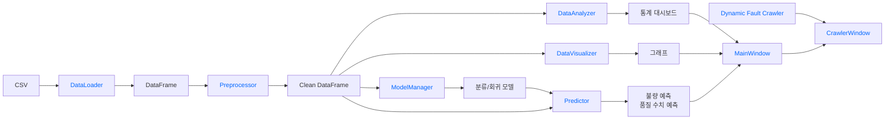
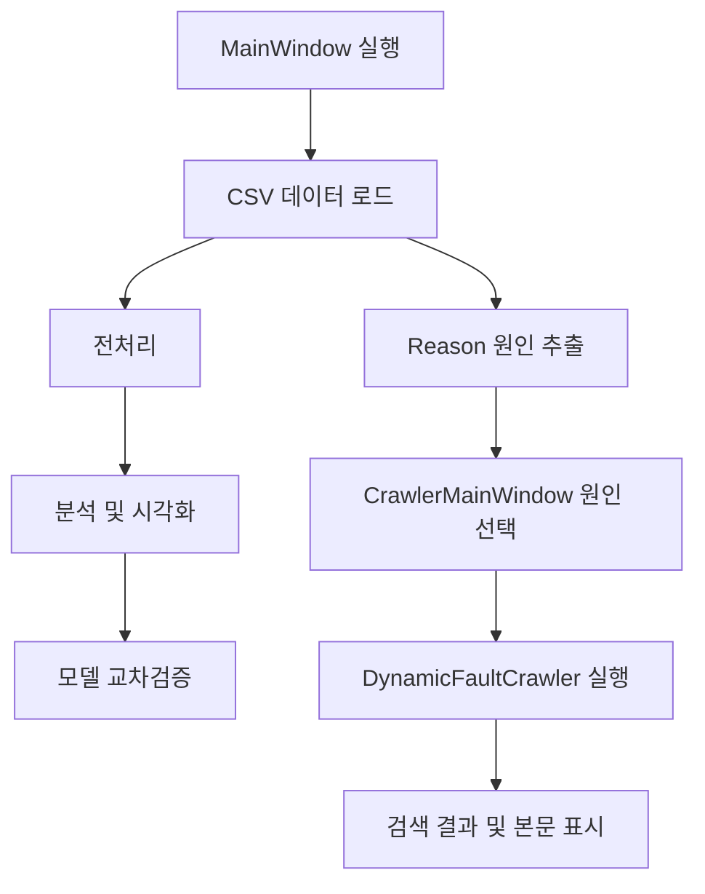
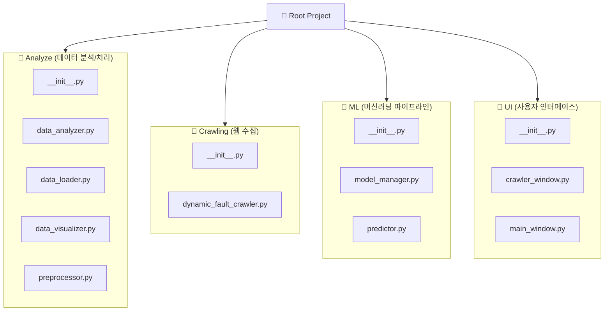

## 사용기술

## 실행방법

- main_crawler.py 실행

## 페이지 설명 (기능, 함수, 클래스 별로)

## Architecture

## Module

- 분석 
  - [DataLoader](Analyze/data_loader.py) : CSV 데이터를 불러오는 모듈
  - [Preprocessor](Analyze/preprocessor.py) : CSV 데이터를 학습하기 위해서 전처리하는 모듈
  - [DataAnalyzer](Analyze/data_analyzer.py) : 전처리 된 데이터의 주요 지표를 분석하는 모듈
  - [DataVisualizer](Analyze/data_visualizer.py) : 데이터 값을 시각화 하는 모듈
- 머신 러닝
  - [ModelManager](ML/model_manager.py) : 머신러닝 모델 학습
  - [Predictor](ML/predictor.py) : 학습된 머신러닝 모델 우리 데이터에 적용
- UI
  - [MainWindow](UI/main_window.py) : 크롤링을 포함하지 않는 UI 
  - [CrawlerWindow](UI/crawler_window.py) : 크롤링 포함 UI
- 크롤링
  - [DynamicFaultCrawler](Crawling/dynamic_fault_crawler.py) : 고장 원인을 네이버에 자동으로 검색하고 관련 링크를 제공

---
### [DataLoader](Analyze/data_loader.py)

- def load_csv(self, file_path)
  - CSV 데이터를 읽어서 데이터 프레임에 저장

### [Preprocessor](Analyze/preprocessor.py)
remove_duplicates() : 모든 컬럼의 값이 동일한 중복 행을 제거

convert_datetime("TimeStamp") : TimeStamp가 문자열로 들어왔다면 Pandas의 날짜·시간 자료형으로 변환

fill_missing() : 결측치 처리

encode_target() : Target 숫자 변환

remove_constant_numeric_columns() : 값이 항상 같은 센서 컬럼 제거

### [DataAnalyzer](Analyze/data_analyzer.py)
get_product_distribution() : 제품별 생산 비율

get_quality_distribution() : 양품/불량 비율

get_numeric_mean_summary() : 주요 수치 데이터 평균

get_fault_reason_distribution() : 고장 원인 분석

### [DataVisualizer](Analyze/data_visualizer.py)

- `plot_histogram(self, column: str, bins: int = 30) -> Figure`
  - 히스토그램 : 특정 수치형 컬럼의 데이터가 어느 값의 범위에 주로 분포하는지 확인
- `plot_boxplot(self, column: str, group_column: str | None = None) -> Figure`
  - 박스플롯 : 수치형 컬럼의 값이 어디에 몰려 있고, 얼마나 퍼져 있으며, 이상치가 있는지 확인
- `def plot_correlation_heatmap(self) -> Figure`
  - 히트맵 : 어떤 수치형 변수끼리 같이 움직이는가 확인
---
### [ModelManager](ML/model_manager.py)

### [Predictor](ML/predictor.py)

---

## UI

### [MainWindow](UI/main_window.py)

_configure_styles() : 제목, 표, 탭, 상태 표시줄의 공통 디자인 설정

_build_ui() : CSV 선택 영역, 기능 버튼, Notebook 탭 및 상태 표시줄 생성

_make_tab_icon(name, color) : Notebook 탭에 표시할 색상 아이콘 생성

_build_preview_tab() : CSV 데이터의 상위 100행을 보여주는 미리보기 화면 생성

_build_analysis_tab() : 전체 데이터, 제품 비율, 불량률 및 분석 그래프를 보여주는 대시보드 생성

_build_chart_tab() : 그래프 종류와 센서 컬럼을 선택하는 시각화 화면 생성

_build_model_tab() : 제품별 머신러닝 교차검증 결과와 성능 비교 화면 생성

browse_file() : 파일 탐색기를 이용하여 CSV 파일 선택

load_data(file_path) : CSV 데이터를 불러오고 CN7·RG3 데이터 및 제품 정보를 추출

preprocess_data() : 중복 제거, 날짜 변환, 결측치 처리, Target 변환 및 상수 컬럼 제거

run_analysis() : 제품 비율, 품질 분포, 수치 평균 및 고장 원인을 분석하여 대시보드에 표시

render_selected_chart() : 선택한 그래프 종류와 센서에 맞는 시각화 생성

run_model_evaluation() : 제품별 머신러닝 모델의 5-fold 교차검증과 성능 평가 실행

render_model_chart() : 모델별 Precision, Recall, F1, ROC-AUC 성능 비교 그래프 생성

_analysis_data() : 분석에 사용할 전처리 데이터 또는 임시 분석 데이터 반환

_update_preview(df) : DataFrame의 컬럼과 상위 100행을 미리보기 표에 표시

_update_sensor_columns(df) : 수치형 컬럼을 추출하여 시각화용 센서 목록 갱신

_show_figure(figure, frame, canvas_attr) : Matplotlib 그래프를 Tkinter 화면에 표시

_set_text(widget, content) : Text 위젯의 기존 내용을 지우고 새로운 내용 입력

_run_ui_action(action) : UI 기능을 실행하고 발생한 오류를 팝업으로 표시

_display_value(value) : 결측치와 실수를 미리보기 화면에 적합한 형식으로 변환

### [CrawlerMainWindow](UI/crawler_window.py)

__init__(root) : 기존 MainWindow에 고장 원인 조사 탭과 크롤링 관련 변수 추가

load_data(file_path) : CSV 데이터를 불러온 후 Reason 컬럼에서 고장 원인 목록 추출

_build_crawler_tab() : 고장 원인 선택, 검색 설정, 검색 결과 및 본문 미리보기 화면 생성

_update_fault_reasons(df) : 고장 원인별 발생 건수를 계산하여 Listbox에 표시

_on_fault_reason_selected(event) : 사용자가 선택한 고장 원인의 위치 확인

_select_fault_reason(index) : 선택한 고장 원인을 저장하고 웹 검색어 자동 생성

start_fault_crawl() : 검색 조건을 검사하고 별도 Thread에서 웹 크롤링 시작

_crawl_worker(query_text, max_pages, headless) : DynamicFaultCrawler를 실행하고 결과를 Queue에 저장

_poll_crawl_queue() : 크롤링 진행 상황, 완료 결과 및 오류를 Queue에서 확인

_display_crawl_results(results) : 검색 문서의 제목과 URL을 Treeview에 표시

_show_crawl_content(event) : 선택한 문서의 제목, URL 및 수집 본문 표시

open_selected_crawl_url(event) : 선택한 검색 결과를 기본 웹 브라우저에서 열기

_show_crawl_error(message) : 크롤링 오류를 상태 표시줄과 팝업창에 표시

### UI 처리 순서

---

### [DynamicFaultCrawler](Crawling/dynamic_fault_crawler.py)

CrawlResult Class

: 웹에서 최종 수집된 문서 한 건의 메타데이터와 본문을
담는 데이터 컨테이너

- **title**: str, **url**: str, **content**: str

**DynamicFaultCrawler Class**

: Selenium과 BeautifulSoup을 결합하여 네이버 검색 결과를 순회하고 유효 문서를 검증·수집

- 생성자 및 실행 제어 메서드

  - init(self, headless=True, timeout=12, max_content_chars=6000)
    - 롤러의 브라우저 실행 옵션(백그라운드 헤드리스 여부), 페이지 로딩 타임아웃 제한 시간, 본문 텍스트의 최대 보관 글자 수를 설정

  - crawl(self, query, max_pages=5, progress=None, required_reason=None) -> list[CrawlResult]
    - 입력값 검증 후 Selenium Chrome 드라이버를 기동하여 네이버 검색 결과를 최대 20페이지까지 순회

  - 텍스트 정제 및 URL 생성 메서드

    build_search_url(cls, query: str, start: int = 1) -> str
  
    검색어(query)를 URL 인코딩(quote_plus)하고 검색 시작 위치(start)를 매핑하여 네이버 웹 검색 URL을 조합합니다.
  
    normalize_text(value: str | None) -> str
  
    줄바꿈, 탭, 연속된 다중 공백을 단일 공백으로 치환하고 문자열 양 끝의 공백을 제거합니다.

    infer_reason(cls, query: str) -> str
    
    사용자가 고장 원인을 직접 지정하지 않았을 때, 검색어 문자열에서 REASON_TERMS의 키워드(가스, 미성형, 초기허용불량)를 탐색하여 고장 원인을 자동 추출합니다.

  - 문서 파싱 및 유효성 검증 메서드
  
    extract_search_links(cls, html: str) -> list[tuple[str | None, str]]
  
    네이버 검색 결과 컨테이너 내부의 <a> 태그들을 파싱하여, 네이버 자체 서비스 도메인(BLOCKED_RESULT_HOSTS)을 제외한 외부 실제 웹 문서의 URL과 검색 제목 목록을 추출합니다.
  
    _unique_links(cls, links) -> list[tuple[str, str]]
  
    추출된 링크 목록에서 프로토콜(http/https) 및 호스트 유효성을 확인하고 중복된 URL을 제거하여 고유 후보 목록을 만듭니다.
  
    parse_document(cls, html: str, fallback_title: str = "") -> tuple[str, str]
  
    대상 페이지의 HTML에서 노이즈 태그(<script>, <style>, <nav>, <footer> 등)를 완전히 제거(decompose)한 후, <title> 태그와 본문 영역(<article> $\to$ <main> $\to$ <body>)에서 순수 텍스트를 추출합니다.
  
    is_korean_document(cls, title: str, content: str) -> bool
  
    정규표현식([가-힣])을 사용해 제목 한글 수($\ge 1$자), 본문 한글 수($\ge 20$자), 본문 전체 알파벳/한글 대비 한글 비중($\ge 25\%$)을 계산하여 한국어 문서인지 검증합니다.
  
  
  evaluate_relevance(cls, title: str, content: str, reason: str) -> tuple[bool, list[str]]
  
  문서가 4대 기준(① 한국어 문서 여부, ② 제목 내 사출성형 용어 포함 여부, ③ 제목/본문 내 불량 원인 동의어 포함 여부, ④ 본문 내 제조 공정 일반 용어 2회 이상 등장 여부)을 모두 만족하는지 판정하고 통과 여부와 탈락 사유 목록을 반환합니다.
  
  
  시스템 지원 및 알림 보조 메서드
  
  _notify(progress: Callable[[str], None] | None, message: str) -> None
  
  콜백 함수가 등록되어 있을 경우 크롤링 진행 상황이나 필터 탈락 사유 메시지를 안전하게 전달합니다.
  
  _import_selenium()
  
  Selenium 패키지를 동적으로 로드하며, 환경에 모듈이 설치되어 있지 않을 경우 명확한 설치 안내 문구를 담은 RuntimeError를 발생시킵니다.

---

## 폴더 구조

