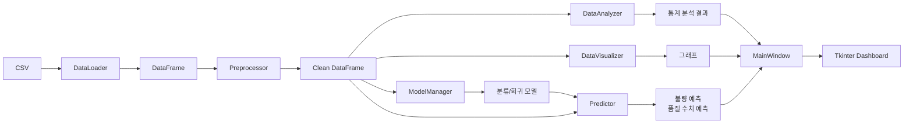

## MES 데이터 분석 프로젝트 아키텍처

```mermaid
graph LR

    A[CSV] --> B[DataLoader]
    B --> C[DataFrame]

    C --> D[Preprocessor]
    D --> E[Clean DataFrame]

    E --> F[DataAnalyzer]
    E --> G[DataVisualizer]
    E --> H[ModelManager]

    F --> I[통계 분석 결과]
    G --> J[그래프]

    H --> K[분류/회귀 모델]

    K --> L[Predictor]
    E --> L

    L --> M[불량 예측<br/>품질 수치 예측]

    I --> N[MainWindow]
    J --> N
    M --> N

    N --> O[Tkinter Dashboard]
```