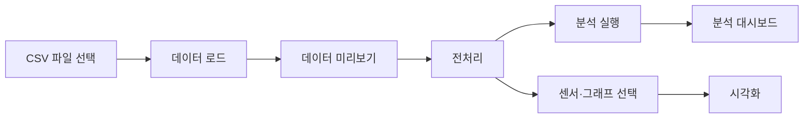
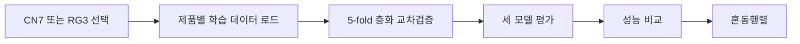
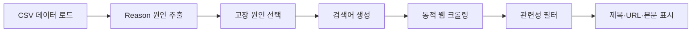
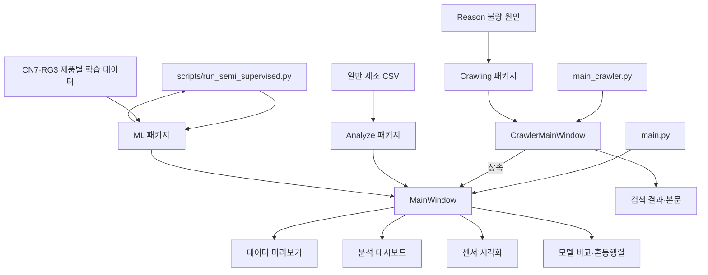

# CN7·RG3 사출성형 불량 예측 및 데이터 분석

사출성형 공정 데이터를 이용하여 CN7·RG3 제품의 생산·품질 현황을 분석하고, 공정 센서값을 기반으로 불량 예측 가능성을 검증하는 Python 데이터 분석 프로젝트입니다.

데이터 전처리, 통계분석, 시각화, 머신러닝 모델 비교와 불량 원인 관련 웹 문서 수집 기능을 하나의 데스크톱 UI로 제공합니다.

---

## 기술스택

- [기술스택 문서](doc/README_Stack.md)

---

## 1. 프로젝트 개요

본 프로젝트는 사출성형 제조 공정에서 수집된 센서 데이터와 품질 판정 데이터를 활용하여 다음 작업을 수행합니다.

1. 제조 공정 CSV 데이터 로드
2. 중복·결측치·날짜·타깃 데이터 전처리
3. CN7·RG3 제품 구성 분석
4. 양품·불량 비율과 불량 원인 분석
5. 공정 센서 데이터 시각화
6. GaussianNB·RandomForest·SVM 성능 비교
7. 5-fold 층화 교차검증
8. pseudo-labeling 기반 반지도학습 실험
9. 불량 원인 관련 한국어 기술문서 검색

분석 결과는 Tkinter와 `ttkbootstrap`으로 구현한 데스크톱 UI에서 확인할 수 있습니다.

---

## 2. 프로젝트 목표

### 제조 데이터 분석

- CN7·RG3 제품별 생산 비율 확인
- 양품·불량 건수와 전체 불량률 확인
- 주요 공정 센서 평균 분석
- 불량 원인별 발생 건수와 비율 분석

### 데이터 시각화

- 센서값 분포 확인
- 양품과 불량의 센서값 비교
- 수치형 공정 변수 사이의 상관관계 확인

### 머신러닝 불량 예측

- Gaussian Naive Bayes
- Random Forest
- SVM

세 모델을 동일한 5-fold 층화 교차검증으로 평가하고 precision, recall, F1, ROC-AUC와 혼동행렬을 비교합니다.

### 고장 원인 조사

CSV의 `Reason` 컬럼에서 불량 원인을 선택하고 네이버 웹 검색을 통해 관련 한국어 사출성형 기술문서를 수집합니다.

---

## 3. 주요 기능

| 기능 | 설명 |
|---|---|
| CSV 데이터 로드 | 제조 공정 CSV를 Pandas DataFrame으로 변환 |
| 제품 필터링 | CN7·RG3 제품 데이터만 선택 |
| 데이터 전처리 | 중복·날짜·결측치·타깃·상수 컬럼 처리 |
| 분석 대시보드 | 제품 비율·불량률·센서 평균·불량 원인 표시 |
| 히스토그램 | 선택한 센서값의 분포 확인 |
| 품질별 박스플롯 | 양품·불량 센서 분포 비교 |
| 상관관계 히트맵 | 수치형 공정 변수의 상관관계 확인 |
| 모델 평가 | GaussianNB·RandomForest·SVM 비교 |
| 교차검증 | 5-fold 층화 교차검증 |
| pseudo-labeling | 비라벨 데이터의 의사라벨 학습 |
| 고장 원인 조사 | 관련 한국어 제조 문서 검색·수집 |

---

## 4. 실행 화면

### 4.1 분석 대시보드


전처리된 데이터를 기준으로 다음 정보를 표시합니다.

- 전체 데이터 건수
- CN7·RG3 제품 비율
- 전체 불량률
- 시간·속도·압력·위치 센서 평균
- 불량 원인별 발생 건수와 비율

### 4.2 모델 및 예측


CN7 또는 RG3를 선택하여 다음 모델의 5-fold 교차검증 결과를 비교합니다.

- RandomForest
- SVM
- GaussianNB

확인 가능한 결과:

- 라벨 데이터 수와 불량 비율
- F1 기준 최고 모델
- precision·recall·F1·ROC-AUC
- 모델별 성능 비교 그래프
- 모델별 혼동행렬

### 4.3 고장 원인 조사


CSV에서 추출한 불량 원인을 기준으로 관련 웹 문서를 검색합니다.

확인 가능한 결과:

- 고장 원인별 발생 건수
- 검색어와 수집 문서 수
- 검색 문서 제목
- 출처 URL
- 수집 본문
- 원문 브라우저 열기

더 많은 실행 화면은 다음 문서에서 확인할 수 있습니다.

- [Analyze 실행 화면](Analyze/README.md#6-실행-화면과-페이지별-기능)
- [UI 실행 화면](UI/README.md#7-실행-화면과-페이지별-기능)

---

## 5. 사용 기술

| 구분 | 기술 |
|---|---|
| Language | Python |
| Data Processing | Pandas, NumPy |
| Machine Learning | scikit-learn |
| Visualization | Matplotlib |
| Desktop UI | Tkinter, ttkbootstrap |
| Crawling | Selenium, BeautifulSoup |
| Model | GaussianNB, RandomForest, SVM |
| Evaluation | StratifiedKFold, GridSearchCV |
| Data Format | CSV |
| Documentation | Markdown, Mermaid |

---

## 6. 실행 환경 준비

### 6.1 프로젝트 폴더로 이동

```bash
cd python-mini-project
```

### 6.2 필수 라이브러리 설치

```bash
python -m pip install pandas numpy matplotlib scikit-learn ttkbootstrap
```

### 6.3 크롤링 라이브러리 설치

고장 원인 조사 기능을 사용할 경우 다음 라이브러리도 설치합니다.

```bash
python -m pip install beautifulsoup4 selenium
```

크롤링 기능에는 다음 환경이 필요합니다.

- 인터넷 연결
- Chrome 브라우저
- Chrome과 호환되는 Selenium WebDriver

### 6.4 PyCharm에서 실행하는 경우

1. PyCharm에서 `python-mini-project` 폴더를 엽니다.
2. 프로젝트 Python Interpreter를 설정합니다.
3. PyCharm Terminal에서 필요한 라이브러리를 설치합니다.
4. `main.py` 또는 `main_crawler.py`를 실행합니다.

> 모든 실행 명령은 `python-mini-project` 프로젝트 루트를 기준으로 사용합니다.

---

## 7. 실행 방법

### 7.1 기본 분석 UI

```bash
python main.py
```

사용 가능한 기능:

- CSV 데이터 로드
- 데이터 전처리
- 분석 대시보드
- 센서 시각화
- CN7·RG3 모델 평가

### 7.2 크롤링 포함 UI

```bash
python main_crawler.py
```

기본 분석 UI의 모든 기능과 다음 기능을 사용할 수 있습니다.

- 불량 원인 목록 확인
- 원인별 웹 검색
- 한국어 사출성형 문서 수집
- 검색 결과와 본문 미리보기

### 7.3 CLI 모델 평가

```bash
python scripts/run_semi_supervised.py
```

CN7과 RG3의 세 모델을 모두 평가합니다.

#### CN7만 실행

```bash
python scripts/run_semi_supervised.py --product cn7
```

#### RG3만 실행

```bash
python scripts/run_semi_supervised.py --product rg3
```

#### 하이퍼파라미터 탐색

```bash
python scripts/run_semi_supervised.py --tune
```

#### pseudo-labeling 사용

```bash
python scripts/run_semi_supervised.py --pseudo-label
```

상세한 CLI 옵션과 모델 설정은 [ML README](ML/README.md)를 참고합니다.

---

## 8. 권장 사용 순서

### 8.1 일반 데이터 분석



### 8.2 머신러닝 평가

머신러닝 평가에서는 제품별로 가공된 라벨·비라벨 데이터를 별도로 불러옵니다.



### 8.3 고장 원인 조사



---

## 9. 전체 아키텍처



### 패키지별 역할

| 패키지 | 역할 |
|---|---|
| `Analyze` | CSV 로드·전처리·통계분석·시각화 |
| `ML` | 제품별 데이터 로드·모델 생성·교차검증 |
| `UI` | 분석·시각화·모델·크롤링 기능 통합 |
| `Crawling` | 웹 검색·본문 수집·관련성 필터링 |

---

## 10. 데이터 처리 구조

### 일반 분석 데이터

```text
labeled_data.csv
→ DataLoader
→ Preprocessor
→ DataAnalyzer
→ DataVisualizer
→ 분석 대시보드와 상세 그래프
```

### 머신러닝 데이터

```text
moldset_labeled_{product}.csv
+ moldset_unlabeled_{product}.csv
→ ML.dataset
→ StandardScaler
→ GaussianNB·RandomForest·SVM
→ 5-fold 교차검증
→ 성능지표와 혼동행렬
```

### 크롤링 데이터

```text
Reason
→ 검색어
→ 네이버 웹 검색
→ 외부 문서
→ 한국어·사출성형·원인·제조 관련성 검사
→ CrawlResult
```

---

## 11. 데이터셋

데이터 파일은 다음 폴더에 있습니다.

```text
04. Dataset_Molding/
└── dataset/
```

### 주요 데이터

| 데이터 | 행 수 | 용도 |
|---|---:|---|
| `labeled_data.csv` | 7,996 | 일반 데이터 분석 |
| `unlabeled_data.csv` | 795,315 | 전체 비라벨 원본 |
| `moldset_labeled_cn7.csv` | 1,211 | CN7 학습·교차검증 |
| `moldset_unlabeled_cn7.csv` | 35,239 | CN7 pseudo-labeling |
| `moldset_labeled_rg3.csv` | 1,182 | RG3 학습·교차검증 |
| `moldset_unlabeled_rg3.csv` | 35,941 | RG3 pseudo-labeling |

### 품질 타깃

머신러닝 데이터의 `PassOrFail`은 다음과 같이 인코딩되어 있습니다.

| 값 | 의미 |
|---:|---|
| 0 | 양품 |
| 1 | 불량 |

일반 분석 데이터의 `PassOrFail`은 다음 값을 사용합니다.

| 값 | 의미 |
|---|---|
| `Y` | 양품 |
| `N` | 불량 |

---

## 12. 머신러닝 평가 방식

불량 데이터가 매우 적어 한 번의 train/test 분리만으로 평가하면 결과가 크게 흔들릴 수 있습니다.

본 프로젝트에서는 다음 방식으로 평가합니다.

1. 데이터를 5개의 fold로 분할
2. 각 fold의 양품·불량 비율을 유지
3. 4개 fold로 학습
4. 나머지 1개 fold로 평가
5. 위 과정을 5회 반복
6. 성능지표 평균과 합산 혼동행렬 계산

StandardScaler는 데이터 누수를 방지하기 위해 매 fold의 학습 데이터에만 fit합니다.

### 평가 지표

| 지표 | 의미 |
|---|---|
| precision | 불량이라고 예측한 것 중 실제 불량 비율 |
| recall | 실제 불량 중 모델이 찾아낸 비율 |
| F1 | precision과 recall의 조화평균 |
| ROC-AUC | 양품과 불량을 구분하는 전반적인 능력 |
| 혼동행렬 | 실제값과 예측값 조합별 건수 |

---

## 13. 핵심 분석 결과

### 13.1 CN7

- 라벨 데이터: 1,211건
- 실제 불량: 17건
- F1 기준 최고 모델: RandomForest
- F1: 약 `0.337`
- ROC-AUC: 약 `0.95`

CN7은 일부 센서에서 불량과 관련된 신호가 확인되지만, 불량 사례가 17건뿐이라 precision과 recall이 제한적입니다.

### 13.2 RG3

- 라벨 데이터: 1,182건
- 실제 불량: 25건
- 모델별 ROC-AUC: 약 `0.41~0.53`

RG3는 현재 24개 센서와 불량 여부 사이의 통계적 연관성이 매우 낮습니다. 세 모델 모두 무작위 분류와 비슷한 성능을 보이므로 현재 센서값만으로 안정적인 불량 예측을 수행하기 어렵습니다.

### 13.3 결론

- CN7은 예측 신호가 있지만 실제 불량 사례가 부족합니다.
- RG3는 불량 사례가 부족하고 현재 센서의 예측 신호도 부족합니다.
- 알고리즘 변경만으로 해결하기보다 더 많은 실제 불량 사례와 새로운 공정 변수를 확보해야 합니다.
- pseudo-labeling은 현재 데이터에서 지도학습보다 성능을 낮추는 경우가 많아 기본적으로 사용하지 않습니다.

상세 결과와 전체 실험 과정은 [ML README](ML/README.md)를 참고합니다.

---

## 14. 패키지 구성과 상세 문서

| 패키지 | 역할 | 상세 문서 |
|---|---|---|
| `Analyze` | 데이터 로드·전처리·통계분석·시각화 | [Analyze README](Analyze/README.md) |
| `UI` | 데스크톱 화면과 전체 기능 통합 | [UI README](UI/README.md) |
| `ML` | 불량 예측·교차검증·pseudo-labeling | [ML README](ML/README.md) |
| `Crawling` | 불량 원인 웹 문서 검색·수집 | [Crawling README](Crawling/README.md) |

---

## 15. 폴더 구조

```text
python-mini-project/
├── Analyze/
│   ├── __init__.py
│   ├── data_loader.py
│   ├── preprocessor.py
│   ├── data_analyzer.py
│   ├── data_visualizer.py
│   └── README.md
│
├── ML/
│   ├── __init__.py
│   ├── dataset.py
│   ├── models.py
│   ├── evaluation.py
│   ├── semi_supervised.py
│   ├── hyperparameter_search.py
│   └── README.md
│
├── UI/
│   ├── __init__.py
│   ├── main_window.py
│   ├── crawler_window.py
│   └── README.md
│
├── Crawling/
│   ├── __init__.py
│   ├── dynamic_fault_crawler.py
│   ├── dynamic_fault_crawler.md
│   └── README.md
│
├── scripts/
│   └── run_semi_supervised.py
│
├── docs/
│   └── images/
│       ├── analyze-preview.png
│       ├── analyze-dashboard.png
│       ├── analyze-heatmap.png
│       ├── analyze-histogram.png
│       ├── ui-model-result.png
│       └── ui-crawler.png
│
├── 04. Dataset_Molding/
│   └── dataset/
│       ├── labeled_data.csv
│       ├── unlabeled_data.csv
│       ├── moldset_labeled_cn7.csv
│       ├── moldset_unlabeled_cn7.csv
│       ├── moldset_labeled_rg3.csv
│       └── moldset_unlabeled_rg3.csv
│
├── main.py
├── main_crawler.py
├── test.py
├── 04. Guidebook_Molding.pdf
└── README.md
```

---

## 16. 주의사항과 한계

### 불량 표본 부족

CN7과 RG3 모두 실제 불량 데이터가 매우 적습니다. 모델 성능을 해석할 때 accuracy만 보지 않고 precision, recall, F1, ROC-AUC와 혼동행렬을 함께 확인해야 합니다.

### RG3 예측 한계

RG3는 현재 센서값과 불량 여부 사이의 관계가 약합니다. 모델 구조를 변경하는 것보다 새로운 센서와 추가 공정 데이터를 확보하는 것이 우선입니다.

### pseudo-labeling

pseudo-labeling은 모델의 잘못된 예측을 학습 데이터에 추가할 수 있습니다. 현재 데이터에서는 기본 지도학습보다 성능이 낮아질 수 있습니다.

### 실행시간

다음 작업은 시간이 오래 걸릴 수 있습니다.

- GridSearchCV
- pseudo-labeling
- 전체 비라벨 데이터 사용
- SVM 반복 학습

### UI 응답

모델 교차검증은 UI 메인 스레드에서 실행됩니다. 평가 중에는 화면이 일시적으로 응답하지 않는 것처럼 보일 수 있습니다.

### 크롤링 환경

크롤링은 인터넷 연결, Chrome, Selenium과 검색 대상 웹사이트 상태의 영향을 받습니다.

### 화면 이미지

공개 저장소에 실행 화면을 첨부할 때 CSV 입력창에 표시된 사용자명과 로컬 파일 경로를 가리는 것을 권장합니다.

---

## 17. 참고 자료

- `04. Guidebook_Molding.pdf`
- `summary_injection_molding_dataset_guidebook.pdf`
- [Analyze 패키지 문서](Analyze/README.md)
- [UI 패키지 문서](UI/README.md)
- [ML 패키지 문서](ML/README.md)
- [Crawling 패키지 문서](Crawling/README.md)