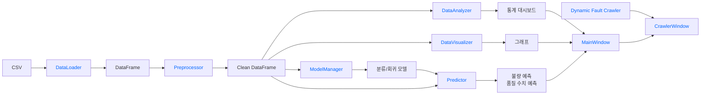
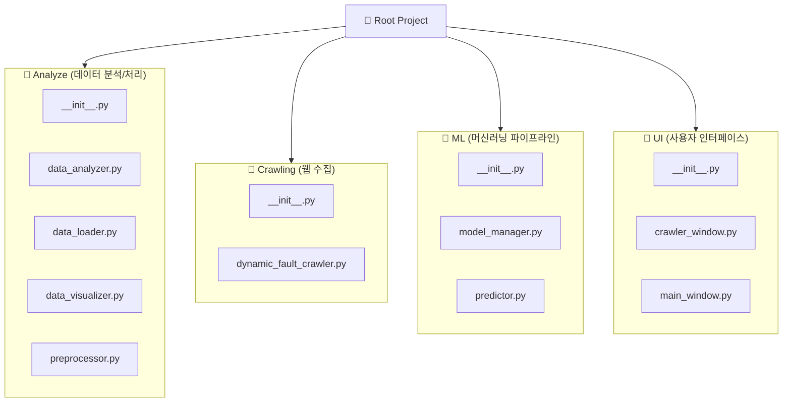

## 프로젝트 제목

## 데이터 분석 프로젝트 아키텍처

```mermaid
graph LR

    A[CSV] --> B[DataLoader]
    B --> C[DataFrame]

    C --> D[Preprocessor]
    D --> E[Clean DataFrame]

    E --> F[DataAnalyzer]
    E --> G[DataVisualizer]
    E --> H[ModelManager]

    F --> I[통계 대시보드]
    G --> J[그래프]

    H --> K[분류/회귀 모델]

    K --> L[Predictor]
    E --> L

    L --> M[불량 예측<br/>품질 수치 예측]

    I --> N[MainWindow]
    J --> N
    M --> N


    P[Dynamic Fault Crawler]
    P --> Q
    Q[CrawlerWindow]
    N --> Q
    %% 클래스 글자색
    classDef pythonClass color:#0066ff;

    %% 클래스 지정
    class B,D,F,G,H,L,N,Q,P pythonClass;
```

## 분석할 데이터
labeled_data.csv

## 폴더 구조

```mermaid
graph TD
    Root["📁 Root Project"]
    
    %% Analyze Group
    subgraph Analyze ["📁 Analyze (데이터 분석/처리)"]
        A0["__init__.py"]
        A1["data_analyzer.py"]
        A2["data_loader.py"]
        A3["data_visualizer.py"]
        A4["preprocessor.py"]
    end

    %% Crawling Group
    subgraph Crawling ["📁 Crawling (웹 수집)"]
        C0["__init__.py"]
        C1["dynamic_fault_crawler.py"]
    end

    %% ML Group
    subgraph ML ["📁 ML (머신러닝 파이프라인)"]
        M0["__init__.py"]
        M1["model_manager.py"]
        M2["predictor.py"]
    end

    %% UI Group
    subgraph UI ["📁 UI (사용자 인터페이스)"]
        U0["__init__.py"]
        U1["crawler_window.py"]
        U2["main_window.py"]
    end

    Root --> Analyze
    Root --> Crawling
    Root --> ML
    Root --> UI
```

## 해야하는 것

2. UI 이쁘게 만들기
