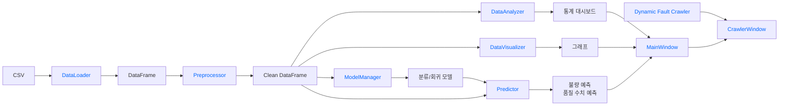
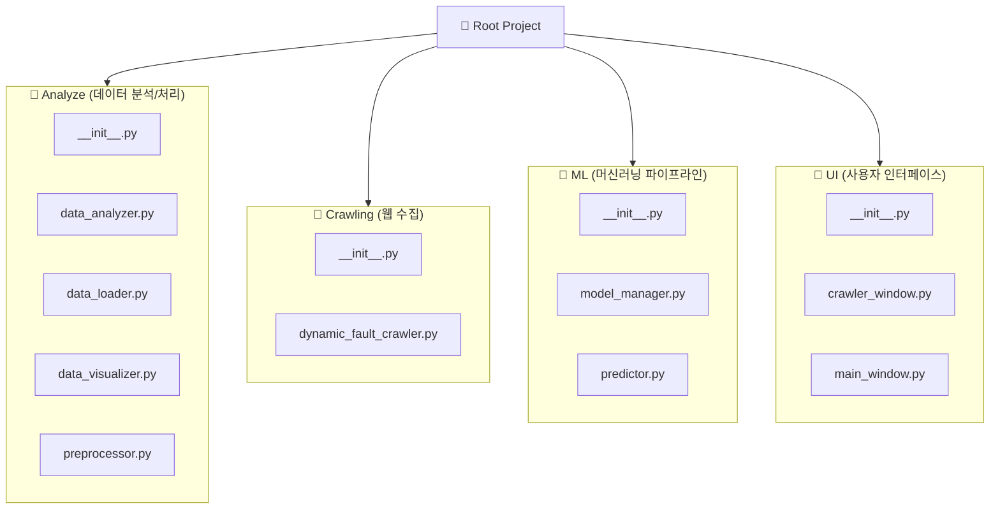

## 사용기술

## 실행방법

## 페이지 설명 (기능, 함수, 클래스 별로)

## Architecture

## Module

- 분석 
  - [DataLoader](Analyze/data_loader.py) : CSV 데이터를 불러오는 모듈
  - [Preprocessor](Analyze/preprocessor.py) : CSV 데이터를 학습하기 위해서 전처리하는 모듈
  - [DataAnalyzer](Analyze/data_analyzer.py) : 전처리 된 데이터의 주요 지표를 분석하는 모듈
  - [DataVisualizer](Analyze/data_visualizer.py) : 데이터 값을 시각화 하는 모듈
- 머신 러닝
  - [ModelManager](ML/model_manager.py) : 머신러닝 모델 학습
  - [Predictor](ML/predictor.py) : 학습된 머신러닝 모델 우리 데이터에 적용
- UI
  - [MainWindow](UI/main_window.py) : 크롤링을 포함하지 않는 UI 
  - [CrawlerWindow](UI/crawler_window.py) : 크롤링 포함 UI
- 크롤링
  - [DynamicFaultCrawler](Crawling/dynamic_fault_crawler.py) : 고장 원인을 네이버에 자동으로 검색하고 관련 링크를 제공

---
### [DataLoader](Analyze/data_loader.py)

- def load_csv(self, file_path)
  - CSV 데이터를 읽어서 데이터 프레임에 저장

### [Preprocessor](Analyze/preprocessor.py)
remove_duplicates() : 모든 컬럼의 값이 동일한 중복 행을 제거

convert_datetime("TimeStamp") : TimeStamp가 문자열로 들어왔다면 Pandas의 날짜·시간 자료형으로 변환

fill_missing() : 결측치 처리

encode_target() : Target 숫자 변환

remove_constant_numeric_columns() : 값이 항상 같은 센서 컬럼 제거

### [DataAnalyzer](Analyze/data_analyzer.py)
get_product_distribution() : 제품별 생산 비율

get_quality_distribution() : 양품/불량 비율

get_numeric_mean_summary() : 주요 수치 데이터 평균

get_fault_reason_distribution() : 고장 원인 분석

### [DataVisualizer](Analyze/data_visualizer.py)

- `plot_histogram(self, column: str, bins: int = 30) -> Figure`
  - 히스토그램 : 특정 수치형 컬럼의 데이터가 어느 값의 범위에 주로 분포하는지 확인
- `plot_boxplot(self, column: str, group_column: str | None = None) -> Figure`
  - 박스플롯 : 수치형 컬럼의 값이 어디에 몰려 있고, 얼마나 퍼져 있으며, 이상치가 있는지 확인
- `def plot_correlation_heatmap(self) -> Figure`
  - 히트맵 : 어떤 수치형 변수끼리 같이 움직이는가 확인
---
### [ModelManager](ML/model_manager.py)

### [Predictor](ML/predictor.py)

---

### [MainWindow](UI/main_window.py)

### [CrawlerWindow](UI/crawler_window.py)

---

### [DynamicFaultCrawler](Crawling/dynamic_fault_crawler.py)

---

## 폴더 구조

