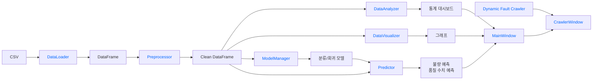
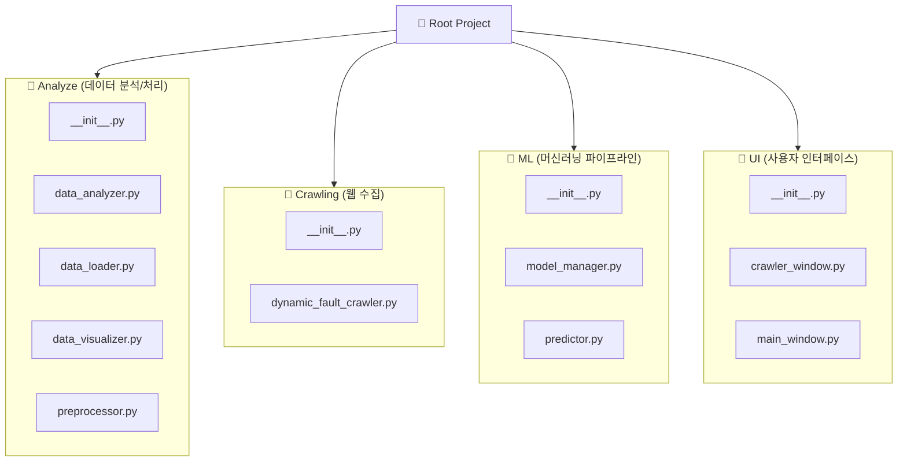

## Architecture

## Module

- 분석 
  - [DataLoader](Analyze/data_loader.py) : CSV 데이터를 불러오는 모듈
  - [Preprocessor](Analyze/preprocessor.py) : CSV 데이터를 학습하기 위해서 전처리하는 모듈
  - [DataAnalyzer](Analyze/analyzer.py) : 전처리 된 데이터의 주요 지표를 분석하는 모듈
  - [DataVisualizer](Analyze/visualizer.py) : 데이터 값을 시각화 하는 모듈
- 머신 러닝
  - [ModelManager](ML/model_manager.py) : 머신러닝 모델 학습
  - [Predictor](ML/predictor.py) : 학습된 머신러닝 모델 우리 데이터에 적용
- UI
  - [MainWindow](UI/main_window.py) : 크롤링을 포함하지 않는 UI 
  - [CrawlerWindow](UI/crawler_window.py) : 크롤링 포함 UI
- 크롤링
  - [DynamicFaultCrawler](Crawling/dynamic_fault_crawler.py) : 고장 원인을 네이버에 자동으로 검색하고 관련 링크를 제공

## 폴더 구조

