# UI 모듈 실행 흐름 정리

## 1. 목적과 파일 구성

`UI` 패키지는 데이터 로드, 전처리, 분석 대시보드, 상세 시각화,
5-fold 교차검증과 고장 원인 크롤링을 ttkbootstrap 기반 Tkinter 화면으로 연결한다.

| 파일 | 클래스 | 역할 |
|---|---|---|
| `main_window.py` | `MainWindow` | 제조 데이터 분석 UI와 작업 순서 관리 |
| `crawler_window.py` | `CrawlerMainWindow` | `MainWindow`를 상속하고 크롤링 탭 추가 |
| `../main.py` | - | 기본 분석 UI 실행 |
| `../main_crawler.py` | - | 크롤링 확장 UI 실행 |

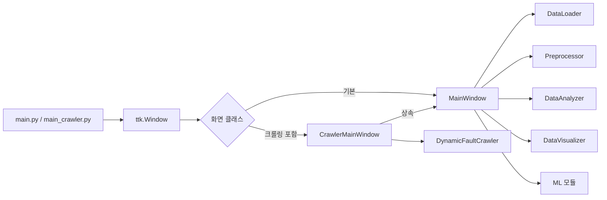

## 2. 사용자 기준 전체 시간 순서

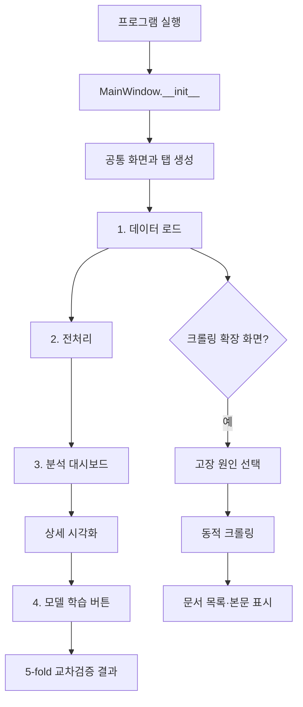

> 상단의 **4. 모델 학습**과 모델 탭의 **5-fold 교차검증 실행**은 모두
> `run_model_evaluation()`을 호출한다. 현재 기능은 최종 모델 저장이 아니라
> fold별 학습과 성능 비교이다.

---

# MainWindow

## 3. 주요 상태값

| 속성 | 내용 | 값이 정해지는 시점 |
|---|---|---|
| `loader` | `DataLoader` 객체 | `__init__()` |
| `raw_df` | CSV 로드·제품 필터 결과 | `load_data()` |
| `clean_df` | 전처리 완료 데이터 | `preprocess_data()` |
| `analyzer` | 통계 집계 객체 | 전처리·분석 시 |
| `visualizer` | Figure 생성 객체 | 전처리·시각화 시 |
| `analysis_chart_canvas` | 대시보드 Canvas | `run_analysis()` |
| `chart_canvas` | 상세 그래프 Canvas | `render_selected_chart()` |
| `model_chart_canvas` | 모델 결과 Canvas | `run_model_evaluation()` |
| `cv_comparison` | 모델별 평균 성능표 | 교차검증 후 |
| `cv_results` | 모델별 fold 결과 | 교차검증 후 |

## 4. 초기화와 화면 생성

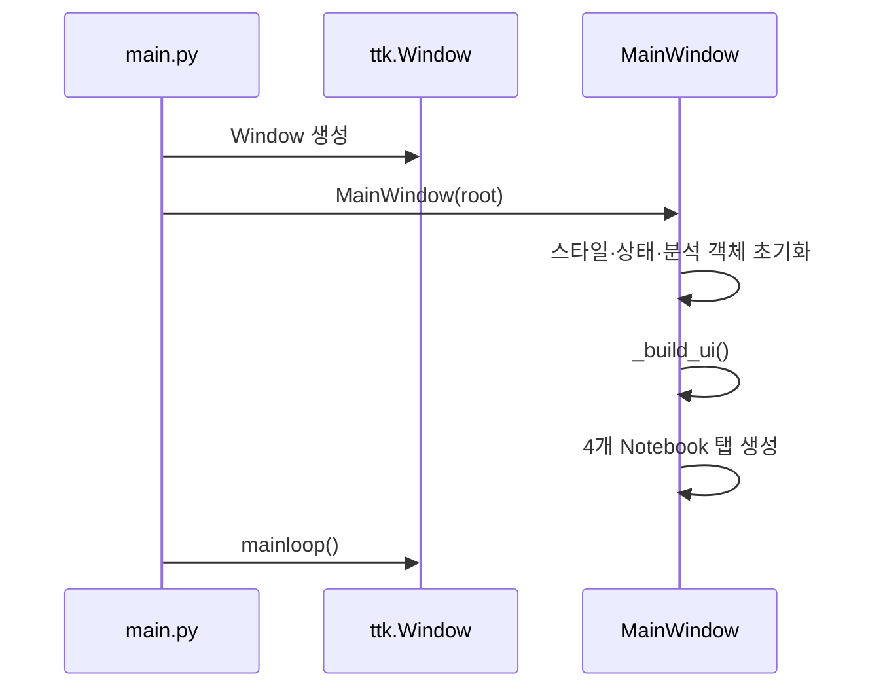

| 순서 | 함수 | 생성·설정 내용 |
|---:|---|---|
| 1 | `__init__()` | 창 크기, 객체, Tk 변수, 기본 경로 |
| 2 | `_configure_styles()` | 폰트, Treeview, Notebook, 상태 스타일 |
| 3 | `_build_ui()` | 제목, 파일 입력, 작업 버튼, Notebook, 상태줄 |
| 4 | `_build_preview_tab()` | DataFrame 미리보기 표 |
| 5 | `_build_analysis_tab()` | KPI 카드와 대시보드 영역 |
| 6 | `_build_chart_tab()` | 그래프·컬럼 선택과 Figure 영역 |
| 7 | `_build_model_tab()` | 제품 선택, 교차검증 결과 영역 |
| 보조 | `_build_kpi_row()` | 반복되는 KPI 카드 생성 |
| 보조 | `_make_tab_icon()` | 탭 아이콘 생성 |

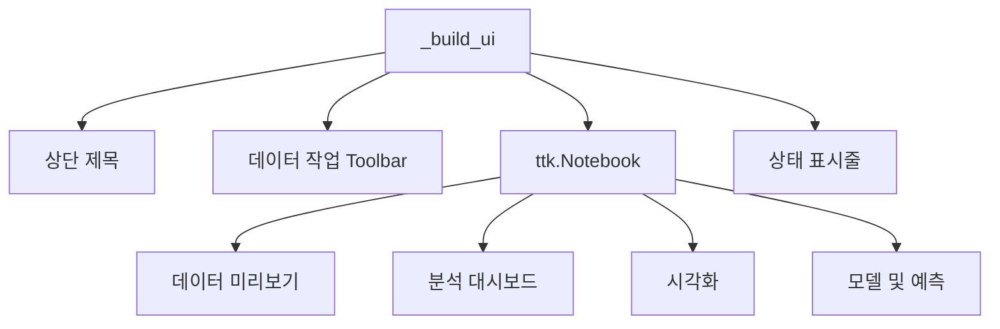

## 5. 데이터 로드 순서

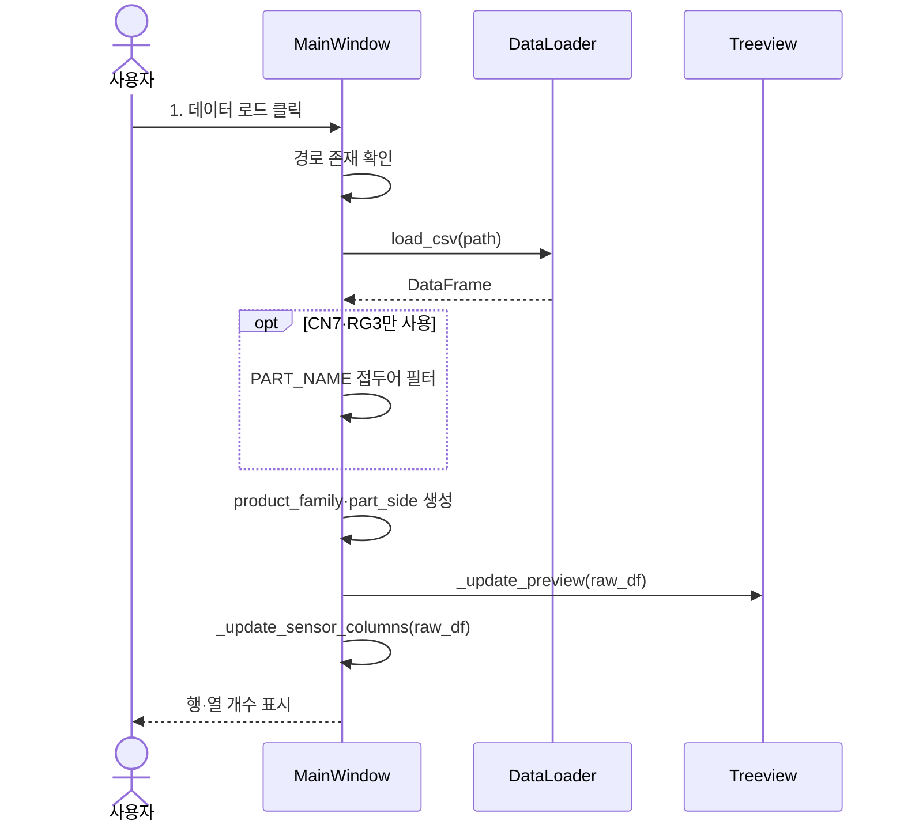

| 순서 | 함수 | 처리 |
|---:|---|---|
| 1 | `browse_file()` | 파일 선택 창에서 CSV 경로 지정 |
| 2 | `load_data()` | CSV 로드, CN7·RG3 필터, 파생 컬럼 생성 |
| 3 | `DataLoader.load_csv()` | `pd.read_csv()` 실행 |
| 4 | `_update_preview()` | 최대 100행을 Treeview에 표시 |
| 5 | `_update_sensor_columns()` | 상세 그래프용 수치 컬럼 목록 갱신 |

## 6. 전처리 순서

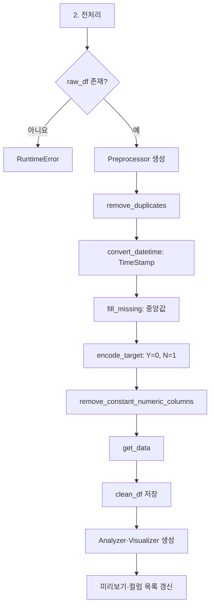

| 순서 | 호출 함수 | 데이터 변화 |
|---:|---|---|
| 1 | `remove_duplicates()` | 완전 중복 행 제거 |
| 2 | `convert_datetime("TimeStamp")` | 날짜·시간 타입 변환 |
| 3 | `fill_missing()` | 수치형 결측치를 중앙값으로 대체 |
| 4 | `encode_target()` | `PassOrFail`에서 `target` 생성 |
| 5 | `remove_constant_numeric_columns()` | 단일 값 수치 컬럼 제거 |
| 6 | `get_data()` | 전처리 결과 복사본 반환 |

## 7. 분석 대시보드 순서

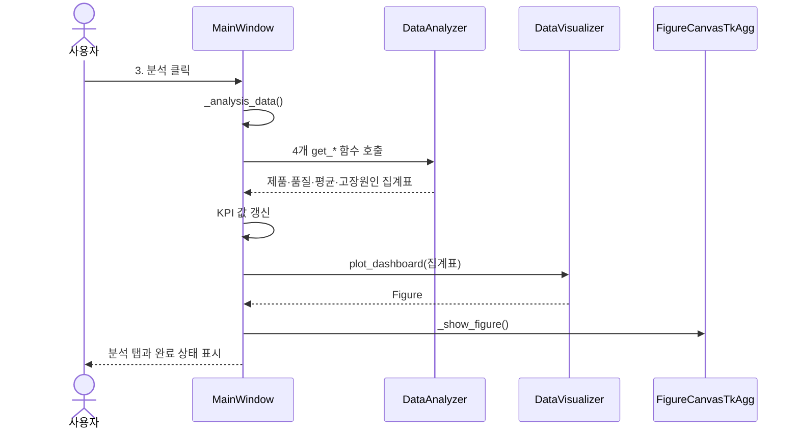

| 화면 영역 | DataAnalyzer 함수 | 표시 내용 |
|---|---|---|
| 전체 KPI | `len(data)` | 전체 행·컬럼 수 |
| CN7·RG3 KPI/파이 | `get_product_distribution()` | 제품별 건수·비율 |
| 양품·불량 KPI/도넛 | `get_quality_distribution()` | 양품·불량 건수·불량률 |
| 특성 평균 막대 | `get_numeric_mean_summary()` | Time·속도·압력·위치 평균 |
| 고장 원인 막대 | `get_fault_reason_distribution()` | 불량 원인별 건수·비율 |

## 8. 상세 시각화 순서

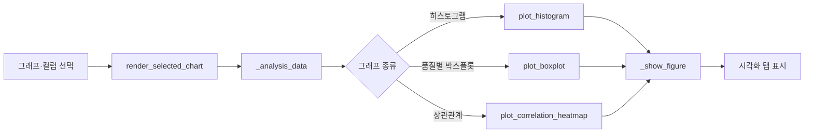

| 선택값 | 호출 함수 | 결과 |
|---|---|---|
| `히스토그램` | `plot_histogram(sensor)` | 선택 컬럼 분포 |
| `품질별 박스플롯` | `plot_boxplot(sensor, "PassOrFail")` | 양품·불량 분포 비교 |
| `상관관계(heatmap)` | `plot_correlation_heatmap()` | 수치형 컬럼 상관관계 |

## 9. 모델 교차검증 순서

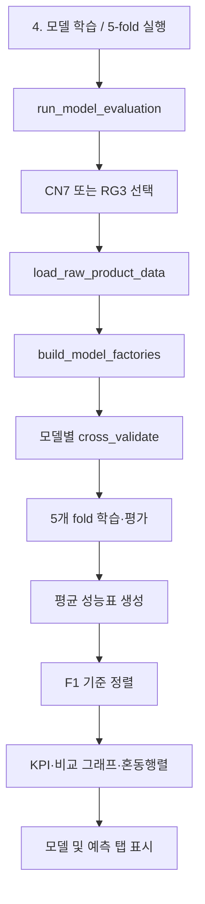

| 함수 | 역할 |
|---|---|
| `run_model_evaluation()` | 데이터 로드부터 모델별 교차검증 표시까지 조정 |
| `_build_model_result_figure()` | 성능 막대그래프와 혼동행렬 생성 |
| `ML.evaluation.cross_validate()` | fold별 스케일링, 학습, 예측, 평가 반복 |

## 10. 공통 보조 함수

| 함수 | 역할 |
|---|---|
| `_analysis_data()` | `clean_df`를 우선 사용하고 없으면 임시 target을 만든 raw 데이터 반환 |
| `_update_preview()` | Treeview 컬럼과 최대 100행 갱신 |
| `_update_sensor_columns()` | 식별자·target 제외 수치 컬럼 갱신 |
| `_show_figure()` | 기존 Canvas 제거 후 새 Figure 삽입 |
| `_set_text()` | Text 위젯 내용을 안전하게 교체 |
| `_run_ui_action()` | 작업 예외를 상태 표시와 messagebox로 전달 |
| `_display_value()` | 결측값과 실수의 표 형식 정리 |

---

# CrawlerMainWindow

## 11. 상속 구조

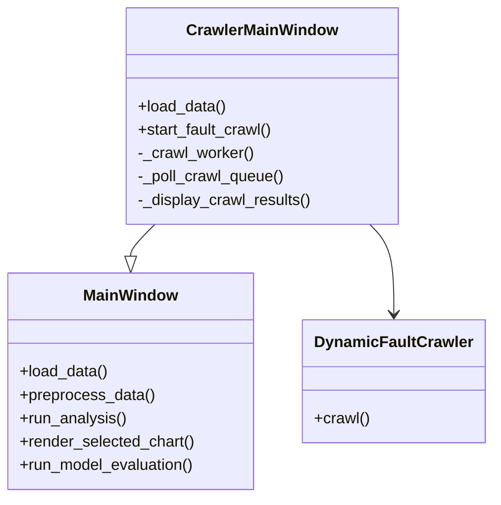

`CrawlerMainWindow.load_data()`는 부모의 로드 기능을 먼저 실행하고
`_update_fault_reasons()`로 `Reason` 목록을 갱신한다.

## 12. 크롤링 UI 시간 순서

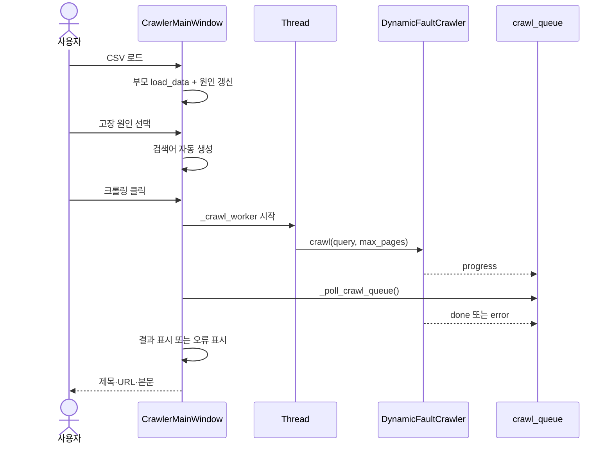

| 순서 | 함수 | 역할 |
|---:|---|---|
| 1 | `_build_crawler_tab()` | 원인 목록, 설정, 결과 표, 본문 창 생성 |
| 2 | `_update_fault_reasons()` | `Reason`별 건수를 Listbox에 표시 |
| 3 | `_on_fault_reason_selected()` | 원인 선택 이벤트 수신 |
| 4 | `_select_fault_reason()` | `사출성형 {원인} 불량 원인 해결 방법` 생성 |
| 5 | `start_fault_crawl()` | 입력 검증, 버튼 잠금, Thread 시작 |
| 6 | `_crawl_worker()` | Selenium 크롤링 수행, Queue에 결과 전달 |
| 7 | `_poll_crawl_queue()` | 100ms 간격으로 progress/done/error 처리 |
| 8 | `_display_crawl_results()` | 제목·URL을 Treeview에 추가 |
| 9 | `_show_crawl_content()` | 선택 문서 제목·URL·본문 출력 |
| 10 | `open_selected_crawl_url()` | 기본 브라우저에서 원문 열기 |
| 오류 | `_show_crawl_error()` | 상태와 오류 대화상자 표시 |

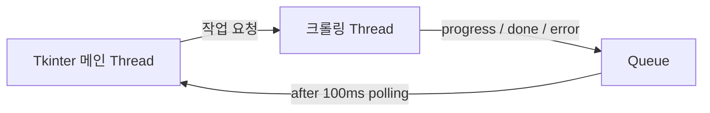

Selenium을 메인 Thread에서 실행하면 로딩 중 UI가 멈춘다. 따라서 실제 수집은
별도 Thread가 수행하고 Tkinter 위젯 변경은 메인 Thread의 Queue polling에서 처리한다.

## 13. 클래스·함수 트리

```text
MainWindow
├── __init__
├── 화면: _configure_styles, _build_ui, _build_*_tab
├── 데이터: browse_file, load_data, preprocess_data
├── 분석: run_analysis, render_selected_chart, run_model_evaluation
└── 보조: _analysis_data, _update_*, _show_figure,
          _set_text, _run_ui_action, _display_value

CrawlerMainWindow(MainWindow)
├── load_data
├── _build_crawler_tab
├── _update_fault_reasons
├── _on_fault_reason_selected
├── _select_fault_reason
├── start_fault_crawl
├── _crawl_worker
├── _poll_crawl_queue
├── _display_crawl_results
├── _show_crawl_content
├── open_selected_crawl_url
└── _show_crawl_error
```