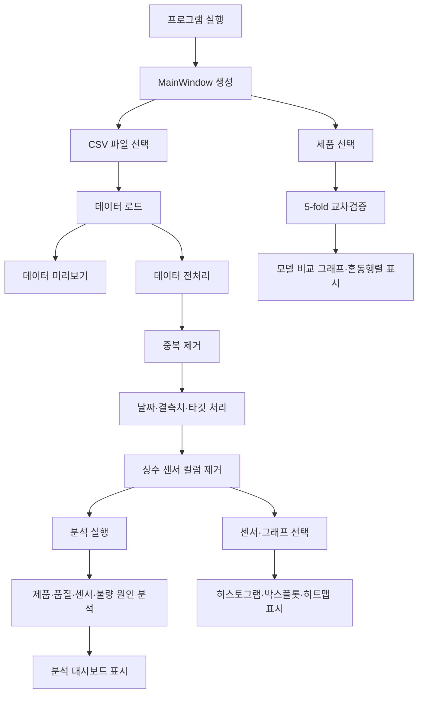
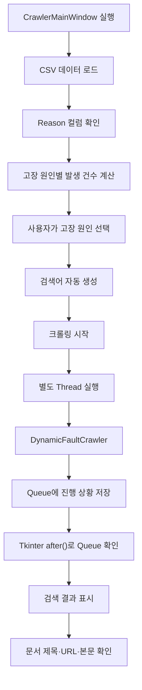
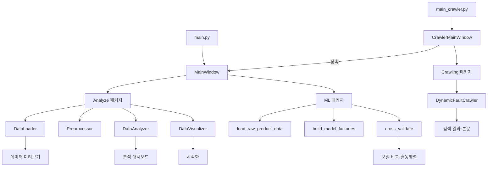

# UI 패키지

## 1. 개요

`UI` 패키지는 사출성형 공정 데이터 분석 프로젝트의 데스크톱 사용자 인터페이스를 담당합니다.

Tkinter와 `ttkbootstrap`을 사용하여 CSV 데이터 로드, 전처리, 통계분석, 시각화, 머신러닝 평가 및 고장 원인 조사를 하나의 프로그램에서 실행할 수 있도록 구성되어 있습니다.

UI는 다음 두 클래스로 구분됩니다.

| 클래스 | 실행 파일 | 주요 기능 |
|---|---|---|
| `MainWindow` | `main.py` | 데이터 분석, 시각화, 모델 교차검증 |
| `CrawlerMainWindow` | `main_crawler.py` | `MainWindow` 기능과 고장 원인 웹 조사 |

`CrawlerMainWindow`는 `MainWindow`를 상속하므로 기존 분석 기능을 그대로 사용하면서 크롤링 기능만 추가합니다.

---

## 2. 주요 기능

- CSV 파일 탐색 및 불러오기
- CN7·RG3 데이터 필터링
- 데이터 상위 100행 미리보기
- 중복·결측치·날짜·타깃 데이터 전처리
- CN7·RG3 제품 비율 분석
- 양품·불량 비율과 불량률 분석
- 공정 센서 평균과 불량 원인 분석
- 히스토그램 생성
- 품질별 박스플롯 생성
- 상관관계 히트맵 생성
- CN7·RG3 머신러닝 모델 교차검증
- 모델별 성능 비교와 혼동행렬 출력
- 불량 원인별 웹 문서 검색
- 검색 결과 제목·URL·본문 확인

---

## 3. 실행 전 준비사항

프로젝트 루트 폴더에서 필요한 라이브러리를 설치합니다.

```bash
python -m pip install pandas numpy matplotlib scikit-learn ttkbootstrap
```

고장 원인 크롤링 기능까지 사용하려면 다음 라이브러리도 설치합니다.

```bash
python -m pip install beautifulsoup4 selenium
```

크롤링 기능은 Chrome 브라우저와 Selenium WebDriver를 사용합니다.

---

## 4. 실행 방법

명령어는 프로젝트 루트 폴더에서 실행해야 합니다.

```text
python-mini-project/
├── main.py
├── main_crawler.py
├── Analyze/
├── Crawling/
├── ML/
└── UI/
```

### 4.1 기본 분석 UI

```bash
python main.py
```

사용 가능한 기능:

- 데이터 미리보기
- 데이터 전처리
- 분석 대시보드
- 센서 데이터 시각화
- CN7·RG3 모델 교차검증

### 4.2 크롤링 포함 UI

```bash
python main_crawler.py
```

사용 가능한 기능:

- 기본 분석 UI의 모든 기능
- CSV의 `Reason` 컬럼에서 고장 원인 추출
- 고장 원인별 웹 문서 검색
- 검색 결과와 수집 본문 확인
- 선택한 문서를 웹 브라우저에서 열기

### 4.3 두 실행 파일의 차이

| 실행 명령 | 생성 클래스 | 고장 원인 조사 |
|---|---|---|
| `python main.py` | `MainWindow` | 미포함 |
| `python main_crawler.py` | `CrawlerMainWindow` | 포함 |

---

## 5. 기본 사용 순서

```text
1. 프로그램 실행
→ 2. CSV 파일 선택
→ 3. 데이터 로드
→ 4. 데이터 전처리
→ 5. 분석 실행
→ 6. 시각화 확인
→ 7. 모델 교차검증 실행
```

크롤링 포함 UI에서는 다음 작업을 추가로 수행할 수 있습니다.

```text
CSV 데이터 로드
→ Reason 목록 생성
→ 고장 원인 선택
→ 검색어 확인 또는 수정
→ 수집 문서 수 설정
→ 크롤링 실행
→ 결과 제목·URL·본문 확인
```

---

## 6. 공통 데이터 작업 영역

프로그램 상단의 데이터 작업 영역은 모든 페이지에서 공통으로 표시됩니다.

주요 구성:

| 구성 요소 | 기능 |
|---|---|
| CSV 파일 입력창 | 현재 선택한 CSV 파일 경로 표시 |
| 찾아보기 | 파일 탐색기로 CSV 선택 |
| CN7·RG3만 사용 | CN7과 RG3 제품만 필터링 |
| 1. 데이터 로드 | CSV 파일을 DataFrame으로 불러오기 |
| 2. 전처리 | 중복·날짜·결측치·타깃·상수 컬럼 처리 |
| 3. 분석 | 제품·품질·센서·불량 원인 분석 |
| 4. 모델 학습 | 제품별 5-fold 교차검증 실행 |

권장 실행 순서:

```text
데이터 로드 → 전처리 → 분석
```

모델 학습 기능은 일반 분석용 CSV가 아니라 `ML.dataset`에서 제품별 가공 데이터를 별도로 불러옵니다.

---

## 7. 실행 화면과 페이지별 기능

실행 화면 이미지는 프로젝트 루트의 다음 폴더에 저장합니다.

```text
docs/
└── images/
    ├── analyze-preview.png
    ├── analyze-dashboard.png
    ├── analyze-heatmap.png
    ├── analyze-histogram.png
    ├── ui-model-result.png
    └── ui-crawler.png
```

---

### 7.1 데이터 미리보기


CSV 파일을 불러온 후 데이터의 컬럼과 상위 100행을 표로 확인합니다.

할 수 있는 작업:

- CSV 파일 선택
- CN7·RG3 데이터만 필터링
- 데이터 로드 결과 확인
- 전체 행과 열 개수 확인
- 전처리 전·후 데이터 비교
- 품질 판정과 불량 원인 확인
- 센서 데이터 확인

화면 하단의 상태 표시줄에는 다음 정보가 나타납니다.

```text
로드 완료: 데이터 행 수 × 컬럼 수
```

미리보기에서는 결측치와 실수 데이터가 화면에 적합한 문자열 형식으로 변환되어 표시됩니다.

---

### 7.2 분석 대시보드


전처리된 데이터를 기준으로 제품 구성, 품질, 공정 센서 평균과 불량 원인을 한 화면에 표시합니다.

KPI 카드:

- 전체 데이터 건수
- 전체 컬럼 수
- CN7 건수와 비율
- RG3 건수와 비율
- 전체 불량 건수
- 전체 불량률

그래프:

- 시간 관련 센서 평균
- 속도 관련 센서 평균
- 압력 관련 센서 평균
- 위치 관련 센서 평균
- CN7·RG3 데이터 비율
- 양품·불량 비율
- 고장 원인별 불량 현황

---

### 7.3 데이터 시각화

시각화 페이지에서는 그래프 종류와 수치형 센서 컬럼을 선택할 수 있습니다.

#### 상관관계 히트맵


전체 수치형 컬럼 사이의 상관계수를 색상으로 표시합니다.

확인할 수 있는 내용:

- 함께 증가하거나 감소하는 센서
- 유사한 공정 특성을 가진 변수
- 중복 정보를 포함할 가능성이 있는 센서
- `target`과 각 센서 사이의 선형적 관계

#### 히스토그램


선택한 센서값이 어느 구간에 분포하는지 확인합니다.

확인할 수 있는 내용:

- 센서값이 집중된 범위
- 전체 데이터의 값 범위
- 분포의 치우침
- 서로 분리된 데이터 집단
- 극단적으로 크거나 작은 값

#### 품질별 박스플롯

선택한 센서값을 `PassOrFail` 기준으로 나누어 양품과 불량의 분포를 비교합니다.

확인할 수 있는 내용:

- 양품과 불량의 중앙값 차이
- 데이터의 분산
- 사분위 범위
- 이상치
- 특정 센서와 품질 판정 사이의 차이

---

### 7.4 모델 및 예측


CN7 또는 RG3 제품을 선택하고 머신러닝 모델의 5-fold 층화 교차검증을 실행합니다.

비교 모델:

- Gaussian Naive Bayes
- Random Forest
- SVM

선택 항목:

| 항목 | 설명 |
|---|---|
| 제품 | CN7 또는 RG3 선택 |
| pseudo-labeling | 라벨 없는 데이터를 의사라벨 학습에 사용할지 선택 |
| 교차검증 실행 | 세 모델의 5-fold 교차검증 실행 |

표시 결과:

- 라벨 데이터 수
- 불량 데이터 수와 비율
- F1 기준 최고 모델
- 최고 모델의 precision
- 최고 모델의 recall
- 최고 모델의 F1
- 최고 모델의 ROC-AUC
- 모델별 성능 비교 막대그래프
- 모델별 합산 혼동행렬

#### 성능지표

| 지표 | 의미 |
|---|---|
| precision | 불량이라고 예측한 데이터 중 실제 불량 비율 |
| recall | 실제 불량 중 모델이 찾아낸 비율 |
| F1 | precision과 recall의 조화평균 |
| ROC-AUC | 양품과 불량을 구분하는 능력 |
| 혼동행렬 | 실제값과 예측값의 조합별 건수 |

> 현재 데이터에서는 pseudo-labeling이 순수 지도학습보다 성능을 낮추는 경우가 많아 기본적으로 사용하지 않는 것이 권장됩니다.

---

### 7.5 고장 원인 조사


이 페이지는 `python main_crawler.py`로 실행한 경우에만 표시됩니다.

할 수 있는 작업:

- CSV의 `Reason` 컬럼에서 불량 원인 목록 확인
- 고장 원인별 발생 건수 확인
- 검색할 고장 원인 선택
- 자동으로 생성된 검색어 확인 및 수정
- 수집할 문서 수 설정
- 헤드리스 브라우저 사용 여부 선택
- 웹 크롤링 진행 상황 확인
- 수집 문서의 제목과 URL 확인
- 선택한 문서의 본문 확인
- 선택 문서를 기본 브라우저에서 열기

크롤링 작업은 UI가 멈추지 않도록 별도 Thread에서 실행됩니다. 진행 상황과 결과는 Queue를 통해 UI 메인 스레드로 전달됩니다.

---

## 8. UI 처리 흐름



---

## 9. 크롤링 UI 처리 흐름



---

## 10. 아키텍처



### 계층별 역할

| 계층 | 담당 패키지 | 역할 |
|---|---|---|
| 사용자 화면 | `UI` | 버튼·탭·표·그래프·상태 표시 |
| 데이터 분석 | `Analyze` | 로드·전처리·통계·시각화 |
| 모델 평가 | `ML` | 데이터 로드·모델 생성·교차검증 |
| 웹 조사 | `Crawling` | 검색·본문 수집·관련성 필터링 |

---

## 11. 클래스와 함수 설명

# `MainWindow`

파일: [main_window.py](main_window.py)

기본 데이터 분석 UI를 구성하고 Analyze·ML 기능을 연결합니다.

### `__init__(root)`

UI에서 사용하는 상태 변수, 데이터 객체, 분석 객체와 그래프 Canvas를 초기화합니다.

### `_configure_styles()`

제목, 버튼, 표, 탭, KPI 카드와 상태 표시줄의 공통 디자인을 설정합니다.

### `_build_ui()`

다음 UI 요소를 생성합니다.

- 프로그램 제목
- CSV 파일 작업 영역
- 단계별 실행 버튼
- Notebook 탭
- 상태 표시줄

### `_make_tab_icon(name, color)`

Notebook 탭에 표시할 색상 아이콘을 생성합니다.

### `_build_preview_tab()`

CSV 데이터의 상위 100행을 표시하는 미리보기 화면을 생성합니다.

### `_build_analysis_tab()`

제품 비율, 불량률, 센서 평균과 불량 원인을 표시하는 분석 대시보드를 생성합니다.

### `_build_chart_tab()`

그래프 종류와 센서 컬럼을 선택하는 시각화 화면을 생성합니다.

### `_build_kpi_row(parent, specs, ...)`

분석 대시보드와 모델 페이지에서 사용하는 카드형 KPI 위젯을 한 행에 배치합니다.

### `_build_model_tab()`

제품 선택, pseudo-labeling 선택, 교차검증 실행 버튼과 모델 평가 결과 영역을 생성합니다.

### `browse_file()`

파일 탐색기를 열어 분석할 CSV 파일을 선택합니다.

### `load_data(file_path=None)`

CSV 데이터를 불러와 미리보기와 센서 목록을 갱신합니다.

`CN7·RG3만 사용`이 선택된 경우 `PART_NAME`이 CN7 또는 RG3로 시작하는 행만 유지합니다.

추가 생성 컬럼:

| 컬럼 | 설명 |
|---|---|
| `product_family` | `PART_NAME`에서 추출한 CN7 또는 RG3 |
| `part_side` | `PART_NAME`에서 추출한 LH 또는 RH |

### `preprocess_data()`

다음 전처리를 순서대로 실행합니다.

1. 완전 중복 행 제거
2. `TimeStamp` 날짜·시간 변환
3. 수치형 결측치 중앙값 대체
4. `PassOrFail`을 `target` 0/1로 변환
5. 상수 수치형 컬럼 제거

### `run_analysis()`

다음 분석 결과를 계산하고 대시보드를 갱신합니다.

- 제품 분포
- 양품·불량 분포
- 센서 평균
- 불량 원인 분포
- KPI 카드
- 종합 대시보드 그래프

### `render_selected_chart()`

사용자가 선택한 그래프를 생성합니다.

지원 그래프:

- 히스토그램
- 품질별 박스플롯
- 상관관계 히트맵

### `run_model_evaluation()`

선택한 제품의 데이터를 불러와 세 모델의 5-fold 교차검증을 실행합니다.

실행 결과:

- 모델별 평균 성능지표
- F1 기준 최고 모델
- 모델 비교 그래프
- 합산 혼동행렬

### `_build_model_result_figure(product, comparison, results)`

모델별 성능 비교 막대그래프와 혼동행렬을 하나의 Matplotlib Figure로 구성합니다.

### `_analysis_data()`

분석에 사용할 DataFrame을 반환합니다.

- 전처리 데이터가 있으면 전처리 데이터 사용
- 전처리 데이터가 없으면 원본 복사본에 임시 `target` 생성
- 데이터가 로드되지 않았으면 오류 발생

### `_update_preview(df)`

DataFrame의 컬럼과 상위 100행을 미리보기 Treeview에 표시합니다.

### `_update_sensor_columns(df)`

수치형 컬럼을 추출하여 시각화 페이지의 센서 선택 목록을 갱신합니다.

### `_show_figure(figure, frame, canvas_attr)`

Matplotlib Figure를 Tkinter Canvas에 연결하여 지정한 화면에 표시합니다.

### `_set_text(widget, content)`

Text 위젯의 기존 내용을 지운 뒤 새로운 내용을 입력합니다.

### `_run_ui_action(action)`

UI 기능을 실행하고 발생한 오류를 팝업창과 상태 표시줄에 표시합니다.

### `_display_value(value)`

미리보기 화면에 표시할 값을 변환합니다.

- 결측치 처리
- 실수 표시 형식 정리
- 일반 데이터를 문자열로 변환

---

# `CrawlerMainWindow`

파일: [crawler_window.py](crawler_window.py)

`MainWindow`를 상속하고 고장 원인 조사 페이지를 추가합니다.

### `__init__(root)`

크롤링 결과, Queue, Thread, 검색 조건과 선택된 고장 원인을 관리하는 변수를 초기화합니다.

### `load_data(file_path=None)`

기본 데이터 로드 기능을 실행한 뒤 `Reason` 컬럼에서 고장 원인 목록을 추출합니다.

### `_build_crawler_tab()`

다음 요소로 구성된 고장 원인 조사 화면을 생성합니다.

- 고장 원인 목록
- 검색어 입력창
- 수집 문서 수 선택
- 헤드리스 실행 선택
- 크롤링 시작 버튼
- 검색 결과 표
- 문서 본문 미리보기
- 브라우저 열기 버튼

### `_update_fault_reasons(df)`

불량 행의 `Reason` 값을 집계하여 고장 원인별 발생 건수를 목록에 표시합니다.

### `_on_fault_reason_selected(event=None)`

사용자가 선택한 고장 원인 항목의 위치를 확인합니다.

### `_select_fault_reason(index)`

선택한 고장 원인을 저장하고 다음 형식의 검색어를 자동으로 생성합니다.

```text
사출성형 {고장 원인} 불량 원인 해결 방법
```

### `start_fault_crawl()`

검색 조건을 검사한 후 크롤링 Thread를 시작합니다.

검사 항목:

- 크롤링 작업이 이미 실행 중인지 확인
- 고장 원인이 선택되었는지 확인
- 검색어가 입력되었는지 확인
- 수집 문서 수가 1~10인지 확인

### `_crawl_worker(query_text, max_pages, headless)`

별도 Thread에서 `DynamicFaultCrawler`를 실행하고 진행 상황·완료 결과·오류를 Queue에 저장합니다.

### `_poll_crawl_queue()`

Queue를 주기적으로 확인하여 다음 이벤트를 처리합니다.

- `progress`: 진행 상황 표시
- `done`: 수집 결과 표시
- `error`: 오류 메시지 표시

### `_display_crawl_results(results)`

검색 문서의 제목과 URL을 Treeview에 표시합니다.

### `_show_crawl_content(event=None)`

선택한 검색 결과의 제목, URL과 본문을 미리보기 영역에 표시합니다.

### `open_selected_crawl_url(event=None)`

선택한 검색 결과를 운영체제의 기본 웹 브라우저에서 엽니다.

### `_show_crawl_error(message)`

크롤링 오류를 상태 표시줄과 팝업창에 표시합니다.

---

## 12. 폴더 구조

```text
UI/
├── __init__.py
│   └── UI 패키지 초기화 파일
│
├── main_window.py
│   └── 데이터 분석·시각화·모델 평가 UI
│
├── crawler_window.py
│   └── MainWindow를 확장한 고장 원인 조사 UI
│
└── README.md
    └── UI 실행 방법과 화면·구조 설명
```

프로젝트에서 UI와 관련된 실행 파일은 루트에 있습니다.

```text
python-mini-project/
├── main.py
│   └── MainWindow 실행
│
├── main_crawler.py
│   └── CrawlerMainWindow 실행
│
├── UI/
├── Analyze/
├── ML/
└── Crawling/
```

---

## 13. 예외 처리

UI에서 실행되는 주요 기능은 `_run_ui_action()`을 통해 예외를 처리합니다.

발생 가능한 오류:

| 상황 | 오류 또는 안내 |
|---|---|
| CSV 파일이 없음 | `FileNotFoundError` |
| 필수 컬럼이 없음 | `KeyError` |
| 수치형이 아닌 센서 선택 | `TypeError` |
| 데이터 로드 전 분석 | `RuntimeError` |
| 잘못된 그래프 종류 | `ValueError` |
| 크롤링 검색어 없음 | 입력 안내 |
| 수집 문서 수 범위 오류 | 1~10 입력 안내 |
| Selenium 미설치 | 설치 방법 안내 |
| 관련 문서 부족 | 크롤링 실패 안내 |

오류가 발생하면 다음 위치에 표시됩니다.

- 상태 표시줄
- 오류 팝업창

---

## 14. 주의사항과 한계

### 모델 평가 중 UI 응답

크롤링은 별도 Thread에서 실행되지만 모델 교차검증은 UI 메인 스레드에서 실행됩니다. 모델 평가 시간이 길어지면 UI가 일시적으로 응답하지 않는 것처럼 보일 수 있습니다.

### CSV 필수 컬럼

일반 분석 기능에는 다음 컬럼이 필요합니다.

- `PART_NAME`
- `PassOrFail`
- `Reason`
- `TimeStamp`
- 수치형 센서 컬럼

필수 컬럼이 없으면 일부 분석 기능이 실행되지 않을 수 있습니다.

### pseudo-labeling

라벨 없는 데이터를 이용하는 pseudo-labeling은 반복 학습으로 인해 실행 시간이 길어질 수 있습니다. 현재 데이터에서는 기본 지도학습보다 성능이 낮아질 수 있습니다.

### 크롤링 환경

고장 원인 조사 기능은 다음 외부 환경의 영향을 받습니다.

- 인터넷 연결 상태
- Chrome과 Selenium 버전
- 네이버 검색 결과 HTML 구조
- 검색 대상 사이트의 접근 제한
- 페이지 로딩 속도

### 화면 이미지의 개인정보

README에 실행 화면을 첨부할 때 CSV 입력창에 표시된 사용자명과 로컬 경로를 가리는 것을 권장합니다.

---

## 15. 다른 패키지와의 관계

| 패키지 | UI에서 사용하는 기능 |
|---|---|
| `Analyze` | CSV 로드, 전처리, 통계분석, 시각화 |
| `ML` | 제품별 데이터 로드, 모델 생성, 교차검증 |
| `Crawling` | 고장 원인 관련 웹 문서 수집 |

관련 문서:

- [프로젝트 전체 README](../README.md)
- [Analyze 패키지](../Analyze/README.md)
- [ML 패키지](../ML/README.md)
- [Crawling 패키지](../Crawling/README.md)